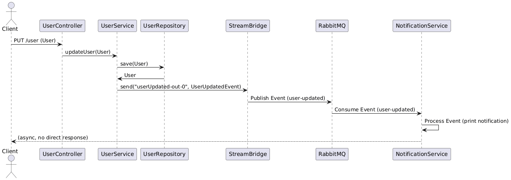

# Arquitecturas Distribuidas & Patrones de Integración - II


<br>


## Explicación de la Arquitectura Basada en Eventos (Event-Driven Architecture)

La **Arquitectura Basada en Eventos** es un patrón de integración en sistemas distribuidos donde los componentes (servicios) se comunican de manera asíncrona mediante **eventos**. En lugar de realizar llamadas directas entre servicios (como en una arquitectura basada en solicitudes/respuestas), un servicio publica un evento cuando ocurre algo relevante (por ejemplo, un usuario es creado o actualizado), y otros servicios suscritos a ese evento lo consumen para realizar acciones correspondientes.

#### Características clave:
- **Asincronía**: Los servicios no esperan una respuesta inmediata, lo que reduce el acoplamiento y mejora la escalabilidad.
- **Desacoplamiento**: Los servicios no necesitan conocerse directamente; solo necesitan saber sobre los eventos que intercambian.
- **Escalabilidad**: Ideal para sistemas con alta carga, ya que los eventos se procesan de forma independiente.
- **Resiliencia**: Si un servicio falla, los eventos pueden almacenarse en colas (como RabbitMQ) para procesarse más tarde.

#### Implementación en Spring Boot con RabbitMQ:
Spring Boot, junto con **Spring Cloud Stream**, simplifica la integración con sistemas de mensajería como **RabbitMQ**. RabbitMQ actúa como un broker de mensajes que gestiona colas y asegura que los eventos se entreguen a los consumidores adecuados. Spring Cloud Stream abstrae los detalles de bajo nivel, permitiendo a los desarrolladores centrarse en la lógica de publicación y consumo de eventos.


<br>

---

<br>
<br>


# Ejemplo práctico: Sistema con dos servicios usando RabbitMQ
<br>

Imagina un sistema con dos microservicios:

1. **User Service**: Gestiona usuarios (GET /user/{id} y PUT /user) y publica un evento cuando un usuario es actualizado.
2. **Notification Service**: Escucha los eventos de actualización de usuarios y envía una notificación (por simplicidad, imprimirá un mensaje en consola).

Usaremos **Spring Cloud Stream** con **RabbitMQ** para comunicar los servicios mediante eventos.

<br>

---

#### 1. Configuración inicial

Asegúrate de tener un servidor **RabbitMQ** corriendo (puedes usar Docker para levantarlo rápidamente):

```bash
docker run -d --name rabbitmq -p 5672:5672 -p 15672:15672 rabbitmq:3-management
```

Esto inicia RabbitMQ con el puerto 5672 para mensajería y 15672 para la interfaz web de administración.

#### 2. Estructura del proyecto

Crearemos 2 aplicaciones Spring Boot:

- **user-service**: Expone los endpoints REST y publica eventos.
- **notification-service**: Escucha eventos y actúa en consecuencia.

<br>
---
<br>
### Proyecto 1: User Service

#### Dependencias (pom.xml)
```xml
<dependencies>
    <dependency>
        <groupId>org.springframework.boot</groupId>
        <artifactId>spring-boot-starter-web</artifactId>
    </dependency>
    <dependency>
        <groupId>org.springframework.cloud</groupId>
        <artifactId>spring-cloud-starter-stream-rabbit</artifactId>
    </dependency>
    <dependency>
        <groupId>org.springframework.boot</groupId>
        <artifactId>spring-boot-starter-data-jpa</artifactId>
    </dependency>
    <dependency>
        <groupId>com.h2database</groupId>
        <artifactId>h2</artifactId>
        <scope>runtime</scope>
    </dependency>
</dependencies>

<dependencyManagement>
    <dependencies>
        <dependency>
            <groupId>org.springframework.cloud</groupId>
            <artifactId>spring-cloud-dependencies</artifactId>
            <version>2023.0.3</version>
            <type>pom</type>
            <scope>import</scope>
        </dependency>
    </dependencies>
</dependencyManagement>
```

#### Configuración (application.yml)

```yaml
server:
  port: 8081

spring:
  rabbitmq:
    host: localhost
    port: 5672
    username: guest
    password: guest
  cloud:
    stream:
      bindings:
        userUpdated-out-0: # Nombre del canal de salida para eventos
          destination: user-updated # Nombre de la cola/exchange en RabbitMQ
  jpa:
    hibernate:
      ddl-auto: update
    show-sql: true
  datasource:
    url: jdbc:h2:mem:users
    driver-class-name: org.h2.Driver
    username: sa
    password:
```
<br>
<br>


#### Modelo (User.java)
```java
package com.example.userservice.model;

import jakarta.persistence.Entity;
import jakarta.persistence.Id;

@Entity
public class User {
    @Id
    private Long id;
    private String name;
    private String email;

    // Getters y setters
...
}
```

#### Evento (UserUpdatedEvent.java)
```java
package com.example.userservice.event;

public class UserUpdatedEvent {
    private Long id;
    private String name;
    private String email;

    public UserUpdatedEvent(Long id, String name, String email) {
        this.id = id;
        this.name = name;
        this.email = email;
    }

    // Getters y setters
...
}
```

#### Repositorio (UserRepository.java)
```java
package com.example.userservice.repository;

import com.example.userservice.model.User;
import org.springframework.data.jpa.repository.JpaRepository;

public interface UserRepository extends JpaRepository<User, Long> {
}
```

#### Servicio (UserService.java)

```java
package com.example.userservice.service;

import com.example.userservice.event.UserUpdatedEvent;
import com.example.userservice.model.User;
import com.example.userservice.repository.UserRepository;
import org.springframework.beans.factory.annotation.Autowired;
import org.springframework.cloud.stream.function.StreamBridge;
import org.springframework.stereotype.Service;

@Service
public class UserService {
    @Autowired
    private UserRepository userRepository;

    @Autowired
    private StreamBridge streamBridge;

    public User getUser(Long id) {
        return userRepository.findById(id)
                .orElseThrow(() -> new RuntimeException("Usuario no encontrado"));
    }

    public User updateUser(User user) {
        User updatedUser = userRepository.save(user);
        // Publicar evento
        UserUpdatedEvent event = new UserUpdatedEvent(
                updatedUser.getId(),
                updatedUser.getName(),
                updatedUser.getEmail()
        );
        streamBridge.send("userUpdated-out-0", event);
        return updatedUser;
    }
}
```

#### Controlador (UserController.java)
```java
package com.example.userservice.controller;

import com.example.userservice.model.User;
import com.example.userservice.service.UserService;
import org.springframework.beans.factory.annotation.Autowired;
import org.springframework.web.bind.annotation.*;

@RestController
@RequestMapping("/user")
public class UserController {
    @Autowired
    private UserService userService;

    @GetMapping("/{id}")
    public User getUser(@PathVariable Long id) {
        return userService.getUser(id);
    }

    @PutMapping
    public User updateUser(@RequestBody User user) {
        return userService.updateUser(user);
    }
}
```

#### Configuración de Spring Boot (UserServiceApplication.java)
```java
package com.example.userservice;

import org.springframework.boot.SpringApplication;
import org.springframework.boot.autoconfigure.SpringBootApplication;
import org.springframework.cloud.stream.annotation.EnableBinding;
import org.springframework.cloud.stream.messaging.Source;

@SpringBootApplication
public class UserServiceApplication {
    public static void main(String[] args) {
        SpringApplication.run(UserServiceApplication.class, args);
    }
}
```

<br>
<br>

---

<br>

### Proyecto 2: Notification Service

<br>
#### Dependencias (pom.xml)
```xml
<dependencies>
    <dependency>
        <groupId>org.springframework.boot</groupId>
        <artifactId>spring-boot-starter</artifactId>
    </dependency>
    <dependency>
        <groupId>org.springframework.cloud</groupId>
        <artifactId>spring-cloud-starter-stream-rabbit</artifactId>
    </dependency>
</dependencies>

<dependencyManagement>
    <dependencies>
        <dependency>
            <groupId>org.springframework.cloud</groupId>
            <artifactId>spring-cloud-dependencies</artifactId>
            <version>2023.0.3</version>
            <type>pom</type>
            <scope>import</scope>
        </dependency>
    </dependencies>
</dependencyManagement>
```

#### Configuración (application.yml)
```yaml
server:
  port: 8082

spring:
  rabbitmq:
    host: localhost
    port: 5672
    username: guest
    password: guest
  cloud:
    stream:
      bindings:
        userUpdated-in-0: # Nombre del canal de entrada para eventos
          destination: user-updated # Misma cola/exchange que en User Service
          group: notification-group # Asegura que los mensajes se procesen en un grupo
```

#### Evento (UserUpdatedEvent.java)
Copia la misma clase `UserUpdatedEvent` del User Service al Notification Service.

#### Consumidor de eventos (NotificationService.java)

```java
package com.example.notificationservice;

import com.example.notificationservice.event.UserUpdatedEvent;
import org.springframework.context.annotation.Bean;
import org.springframework.stereotype.Service;

import java.util.function.Consumer;

@Service
public class NotificationService {

    @Bean
    public Consumer<UserUpdatedEvent> userUpdated() {
        return event -> {
            System.out.println("Notificación: El usuario con ID " + event.getId() +
                    " fue actualizado. Nombre: " + event.getName() +
                    ", Email: " + event.getEmail());
        };
    }
}
```

#### Configuración de Spring Boot (NotificationServiceApplication.java)
```java
package com.example.notificationservice;

import org.springframework.boot.SpringApplication;
import org.springframework.boot.autoconfigure.SpringBootApplication;

@SpringBootApplication
public class NotificationServiceApplication {
    public static void main(String[] args) {
        SpringApplication.run(NotificationServiceApplication.class, args);
    }
}
```

<br>
<br>

---

<br>

### Flujo de trabajo

1. **Iniciar RabbitMQ**: Asegúrate de que RabbitMQ esté corriendo.
2. **Iniciar ambos servicios**: Ejecuta `UserServiceApplication` (puerto 8081) y `NotificationServiceApplication` (puerto 8082).
3. **Probar los endpoints**:
   - **GET /user/{id}**: Usa un cliente como Postman para obtener un usuario (por ejemplo, `GET http://localhost:8081/user/1`). Debes haber creado un usuario previamente en la base de datos H2.
   - **PUT /user**: Actualiza un usuario enviando un JSON como:
   
     ```json:disable-run
     {
         "id": 1,
         "name": "Juan Pérez",
         "email": "juan@example.com"
     }
     ```
     Usa `PUT http://localhost:8081/user`.

4. **Resultado**:
   - Cuando se ejecuta el `PUT /user`, el **User Service** guarda el usuario en la base de datos H2 y publica un evento `UserUpdatedEvent` en la cola `user-updated` de RabbitMQ.
   - El **Notification Service** consume el evento y muestra un mensaje en la consola, como:
   
     ```
     Notificación: El usuario con ID 1 fue actualizado. Nombre: Juan Pérez, Email: juan@example.com
     ```

<br>


---

<br>


### Explicación del flujo

- **User Service**:
  - El endpoint `GET /user/{id}` consulta un usuario en la base de datos H2.
  - El endpoint `PUT /user` actualiza un usuario y publica un evento usando `StreamBridge` al canal `userUpdated-out-0`, que está mapeado al exchange `user-updated` en RabbitMQ.
- **Notification Service**:
  - Escucha la cola `user-updated` a través del canal `userUpdated-in-0` y procesa los eventos con un `Consumer<UserUpdatedEvent>`.
- **RabbitMQ**:
  - Actúa como intermediario, asegurando que los eventos se entreguen al Notification Service incluso si está temporalmente caído (gracias a la persistencia de mensajes en la cola).

<br>

---

<br>


### Consideraciones
<br>


- **Escalabilidad**: Puedes agregar más instancias del Notification Service, y RabbitMQ distribuirá los mensajes entre ellas (usando el grupo `notification-group` para evitar duplicados).
- **Resiliencia**: Si el Notification Service no está disponible, los eventos se acumulan en la cola hasta que se consuman.
- **Monitoreo**: Usa la interfaz de administración de RabbitMQ (`http://localhost:15672`) para verificar las colas y los mensajes.
- **Errores comunes**:
  - Asegúrate de que RabbitMQ esté corriendo y accesible.
  - Verifica que las versiones de Spring Cloud sean compatibles con tu versión de Spring Boot.
  - Configura correctamente los nombres de los canales y destinos en `application.yml`.

Este ejemplo demuestra cómo usar una **Arquitectura Basada en Eventos** con Spring Boot y RabbitMQ para desacoplar servicios y lograr una comunicación asíncrona eficiente. Si necesitas más detalles o quieres extender el ejemplo (por ejemplo, agregar más servicios o manejar errores), házmelo saber.


<br>

Ejemplo de la Arquitectura Basada en Eventos descrita anteriormente, donde un cliente interactúa con el User Service para actualizar un usuario (PUT /user) y se publica un evento que el Notification Service consume a través de RabbitMQ. 

El diagrama muestra la secuencia de interacciones entre los componentes.




Explicación del Diagrama:

* El **Client** envía una solicitud `PUT /user` al `UserController`.
* El **UserController** invoca el método updateUser del **UserService**.
* El **UserService** guarda el usuario en el **UserRepository** (base de datos H2).
* El **UserService** usa **StreamBridge** para enviar un evento `UserUpdatedEvent` al canal `userUpdated-out-0`.
* **StreamBridge** publica el evento en el exchange `user-updated` de RabbitMQ.
* **RabbitMQ** entrega el evento al **NotificationService**, que lo consume y procesa (imprime una notificación).
* La interacción es asíncrona, por lo que el cliente no espera una respuesta del **NotificationService**.


<br>

<br>


### Código Más Conciso

A continuación, presento una versión más concisa del código para los dos servicios (**User Service** y **Notification Service**) usando Spring Boot y RabbitMQ. Se eliminan detalles redundantes, pero se mantiene la funcionalidad completa para los endpoints `GET /user/{id}` y `PUT /user`, y la publicación/consumo de eventos con RabbitMQ.

#### Proyecto 1: User Service

##### Dependencias (pom.xml)

```xml
<project xmlns="http://maven.apache.org/POM/4.0.0" xmlns:xsi="http://www.w3.org/2001/XMLSchema-instance" xsi:schemaLocation="http://maven.apache.org/POM/4.0.0 http://maven.apache.org/xsd/maven-4.0.0.xsd">
    <modelVersion>4.0.0</modelVersion>
    <groupId>com.example</groupId>
    <artifactId>user-service</artifactId>
    <version>0.0.1-SNAPSHOT</version>
    <parent>
        <groupId>org.springframework.boot</groupId>
        <artifactId>spring-boot-starter-parent</artifactId>
        <version>3.2.5</version>
    </parent>
    <dependencies>
        <dependency>
            <groupId>org.springframework.boot</groupId>
            <artifactId>spring-boot-starter-web</artifactId>
        </dependency>
        <dependency>
            <groupId>org.springframework.cloud</groupId>
            <artifactId>spring-cloud-starter-stream-rabbit</artifactId>
        </dependency>
        <dependency>
            <groupId>org.springframework.boot</groupId>
            <artifactId>spring-boot-starter-data-jpa</artifactId>
        </dependency>
        <dependency>
            <groupId>com.h2database</groupId>
            <artifactId>h2</artifactId>
            <scope>runtime</scope>
        </dependency>
    </dependencies>
    <dependencyManagement>
        <dependencies>
            <dependency>
                <groupId>org.springframework.cloud</groupId>
                <artifactId>spring-cloud-dependencies</artifactId>
                <version>2023.0.3</version>
                <type>pom</type>
                <scope>import</scope>
            </dependency>
        </dependencies>
    </dependencyManagement>
</project>
```


##### Configuración (application.yml)


```yml
server:
  port: 8081
spring:
  rabbitmq:
    host: localhost
    port: 5672
    username: guest
    password: guest
  cloud:
    stream:
      bindings:
        userUpdated-out-0:
          destination: user-updated
  jpa:
    hibernate:
      ddl-auto: update
  datasource:
    url: jdbc:h2:mem:users
    driver-class-name: org.h2.Driver
```


##### Modelo y Evento (User.java)


```java
package com.example.userservice;

import jakarta.persistence.Entity;
import jakarta.persistence.Id;

@Entity
public class User {
    @Id
    private Long id;
    private String name;
    private String email;

    public User() {}
    public User(Long id, String name, String email) {
        this.id = id;
        this.name = name;
        this.email = email;
    }
...
}
```

##### Evento (UserUpdatedEvent.java)


```
package com.example.userservice;

public record UserUpdatedEvent(Long id, String name, String email) {}
```


##### Controlador y Servicio (UserController.java)


```java
package com.example.userservice;

import org.springframework.beans.factory.annotation.Autowired;
import org.springframework.cloud.stream.function.StreamBridge;
import org.springframework.data.jpa.repository.JpaRepository;
import org.springframework.web.bind.annotation.*;
import java.util.Optional;

interface UserRepository extends JpaRepository<User, Long> {}

@RestController
@RequestMapping("/user")
class UserController {
    @Autowired private UserRepository userRepository;
    @Autowired private StreamBridge streamBridge;

    @GetMapping("/{id}")
    public User getUser(@PathVariable Long id) {
        return userRepository.findById(id)
                .orElseThrow(() -> new RuntimeException("Usuario no encontrado"));
    }

    @PutMapping
    public User updateUser(@RequestBody User user) {
        User updated = userRepository.save(user);
        streamBridge.send("userUpdated-out-0", new UserUpdatedEvent(updated.getId(), updated.getName(), updated.getEmail()));
        return updated;
    }
}
```


##### Aplicación (UserServiceApplication.java)


```java
package com.example.userservice;

import org.springframework.boot.SpringApplication;
import org.springframework.boot.autoconfigure.SpringBootApplication;

@SpringBootApplication
public class UserServiceApplication {
    public static void main(String[] args) {
        SpringApplication.run(UserServiceApplication.class, args);
    }
}
```

---

#### Proyecto 2: Notification Service

##### Dependencias (pom.xml)


```xml
<project xmlns="http://maven.apache.org/POM/4.0.0" xmlns:xsi="http://www.w3.org/2001/XMLSchema-instance" xsi:schemaLocation="http://maven.apache.org/POM/4.0.0 http://maven.apache.org/xsd/maven-4.0.0.xsd">
    <modelVersion>4.0.0</modelVersion>
    <groupId>com.example</groupId>
    <artifactId>notification-service</artifactId>
    <version>0.0.1-SNAPSHOT</version>
    <parent>
        <groupId>org.springframework.boot</groupId>
        <artifactId>spring-boot-starter-parent</artifactId>
        <version>3.2.5</version>
    </parent>
    <dependencies>
        <dependency>
            <groupId>org.springframework.boot</groupId>
            <artifactId>spring-boot-starter</artifactId>
        </dependency>
        <dependency>
            <groupId>org.springframework.cloud</groupId>
            <artifactId>spring-cloud-starter-stream-rabbit</artifactId>
        </dependency>
    </dependencies>
    <dependencyManagement>
        <dependencies>
            <dependency>
                <groupId>org.springframework.cloud</groupId>
                <artifactId>spring-cloud-dependencies</artifactId>
                <version>2023.0.3</version>
                <type>pom</type>
                <scope>import</scope>
            </dependency>
        </dependencies>
    </dependencyManagement>
</project>
```


##### Configuración (application.yml)


```yml
server:
  port: 8082
spring:
  rabbitmq:
    host: localhost
    port: 5672
    username: guest
    password: guest
  cloud:
    stream:
      bindings:
        userUpdated-in-0:
          destination: user-updated
          group: notification-group
```

##### Evento (UserUpdatedEvent.java)

```java
package com.example.notificationservice;

public record UserUpdatedEvent(Long id, String name, String email) {}

```


##### Consumidor (NotificationService.java)


```java
package com.example.notificationservice;

import org.springframework.context.annotation.Bean;
import org.springframework.stereotype.Service;
import java.util.function.Consumer;

@Service
public class NotificationService {
    @Bean
    public Consumer<UserUpdatedEvent> userUpdated() {
        return event -> System.out.println("Notificación: Usuario ID " + event.id() +
                ", Nombre: " + event.name() + ", Email: " + event.email());
    }
}

```


##### Aplicación (NotificationServiceApplication.java)

```java
package com.example.notificationservice;

import org.springframework.boot.SpringApplication;
import org.springframework.boot.autoconfigure.SpringBootApplication;

@SpringBootApplication
public class NotificationServiceApplication {
    public static void main(String[] args) {
        SpringApplication.run(NotificationServiceApplication.class, args);
    }
}
```


<br>
---
<br>


### Cambios para Mayor Concisión

- **Records**: Se usa `record` para `UserUpdatedEvent`, reduciendo el boilerplate de getters/setters.
- **Repositorio Inline**: El `UserRepository` se define como una interfaz dentro de `UserController.java`.
- **Mínima Configuración**: Se eliminan comentarios redundantes y se simplifican las clases.
- **Estructura Compacta**: Se combinan controlador y servicio en un solo archivo para el **User Service**, manteniendo la funcionalidad.


<br>
---
<br>


### Cómo Probar

1. **Iniciar RabbitMQ**:

   ```bash:disable-run
   docker run -d --name rabbitmq -p 5672:5672 -p 15672:15672 rabbitmq:3-management
   ```

2. **Ejecutar Servicios**:
   - Compila y ejecuta ambos proyectos (`user-service` en puerto 8081 y `notification-service` en puerto 8082).

3. **Probar Endpoints**:
   - **GET /user/{id}**: `curl http://localhost:8081/user/1` (asegúrate de tener un usuario en la base de datos H2).
   - **PUT /user**:

     ```bash
     curl -X PUT -H "Content-Type: application/json" -d '{"id":1,"name":"Juan Pérez","email":"juan@example.com"}' http://localhost:8081/user
     ```

4. **Verificar Notificación**:
   - En la consola del **Notification Service**, verás:

     ```
     Notificación: Usuario ID 1, Nombre: Juan Pérez, Email: juan@example.com
     ```


<br>
---
<br>


### Notas

- El diagrama UML muestra la interacción asíncrona clave entre los servicios a través de RabbitMQ.
- El código es más conciso, pero conserva toda la funcionalidad del ejemplo original.
- Si necesitas agregar más características (como manejo de errores, validaciones, o más endpoints), o ajustar el diagrama UML, házmelo saber.

