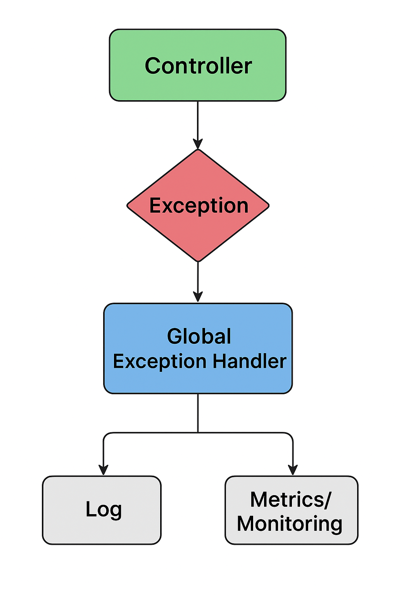

# Control Avanzado de Errores


¡Perfecto! Vamos a desglosarlo bien claro.
Por **Control Avanzado de Errores** me refiero a ir más allá del simple `try-catch`, centralizando el manejo de excepciones, generando respuestas consistentes para APIs, agregando trazabilidad, métricas y resiliencia. Esto es **clave** en aplicaciones modernas con **Spring Boot** y **Java 21**.

---

## 🔹 Definición de Control Avanzado de Errores

1. **Centralización del manejo de excepciones**
   Usar un único punto para capturar y procesar excepciones (por ejemplo, con `@ControllerAdvice`) en lugar de esparcir `try-catch` por toda la app.

2. **Normalización de respuestas de error**
   Responder a clientes siempre con un formato consistente:

   ```json
   {
     "timestamp": "2025-09-04T17:30:00Z",
     "status": 400,
     "error": "Bad Request",
     "message": "El parámetro 'id' es inválido",
     "path": "/api/v1/productos/123"
   }
   ```

3. **Clasificación y tipado de errores**
   Definir jerarquías de excepciones propias (`BusinessException`, `ValidationException`, `DatabaseException`, etc.) para diferenciarlos.

4. **Logging estructurado y trazabilidad**
   Registrar errores con información adicional (ID de correlación, usuario, request, stacktrace) para diagnóstico rápido.

5. **Integración con observabilidad**
   Publicar métricas (con Micrometer/Prometheus), alertas o trazas distribuidas (con OpenTelemetry).

6. **Resiliencia y fallback**
   Integrar mecanismos de reintentos, circuit breakers (con Resilience4j), y colas (RabbitMQ/Kafka) para procesar errores asincrónicos.

---

## 🔹 Ejemplo práctico completo (Spring Boot 3 / Java 21)

Supongamos una API `/productos/{id}` que busca productos, pero queremos:

* Validar parámetros
* Manejar errores de negocio y sistema
* Responder con un JSON estándar
* Loggear y medir métricas

---

### 1. Definir excepciones personalizadas

```java
// src/main/java/com/example/exceptions/NotFoundException.java
package com.example.exceptions;

public class NotFoundException extends RuntimeException {
    public NotFoundException(String message) {
        super(message);
    }
}
```

```java
// src/main/java/com/example/exceptions/BusinessException.java
package com.example.exceptions;

public class BusinessException extends RuntimeException {
    public BusinessException(String message) {
        super(message);
    }
}
```

---

### 2. Crear una clase de respuesta de error

```java
// src/main/java/com/example/dto/ErrorResponse.java
package com.example.dto;

import java.time.Instant;

public record ErrorResponse(
        Instant timestamp,
        int status,
        String error,
        String message,
        String path
) {}
```

---

### 3. Controlador con posibles errores

```java
// src/main/java/com/example/controller/ProductoController.java
package com.example.controller;

import com.example.exceptions.BusinessException;
import com.example.exceptions.NotFoundException;
import org.springframework.web.bind.annotation.*;

@RestController
@RequestMapping("/api/v1/productos")
public class ProductoController {

    @GetMapping("/{id}")
    public String getProducto(@PathVariable String id) {
        if (id.equals("0")) {
            throw new BusinessException("El producto con ID 0 no está permitido");
        }
        if (id.equals("999")) {
            throw new NotFoundException("Producto no encontrado");
        }
        return "Producto con ID: " + id;
    }
}
```

---

### 4. `@ControllerAdvice` para manejo global

```java
// src/main/java/com/example/handler/GlobalExceptionHandler.java
package com.example.handler;

import com.example.dto.ErrorResponse;
import com.example.exceptions.BusinessException;
import com.example.exceptions.NotFoundException;
import jakarta.servlet.http.HttpServletRequest;
import org.springframework.http.HttpStatus;
import org.springframework.http.ResponseEntity;
import org.springframework.web.bind.annotation.*;
import org.springframework.web.method.annotation.MethodArgumentTypeMismatchException;

import java.time.Instant;

@ControllerAdvice
public class GlobalExceptionHandler {

    @ExceptionHandler(NotFoundException.class)
    public ResponseEntity<ErrorResponse> handleNotFound(NotFoundException ex, HttpServletRequest request) {
        return buildErrorResponse(HttpStatus.NOT_FOUND, ex.getMessage(), request.getRequestURI());
    }

    @ExceptionHandler(BusinessException.class)
    public ResponseEntity<ErrorResponse> handleBusiness(BusinessException ex, HttpServletRequest request) {
        return buildErrorResponse(HttpStatus.BAD_REQUEST, ex.getMessage(), request.getRequestURI());
    }

    @ExceptionHandler(MethodArgumentTypeMismatchException.class)
    public ResponseEntity<ErrorResponse> handleTypeMismatch(MethodArgumentTypeMismatchException ex, HttpServletRequest request) {
        return buildErrorResponse(HttpStatus.BAD_REQUEST, "Parámetro inválido", request.getRequestURI());
    }

    @ExceptionHandler(Exception.class)
    public ResponseEntity<ErrorResponse> handleGeneric(Exception ex, HttpServletRequest request) {
        return buildErrorResponse(HttpStatus.INTERNAL_SERVER_ERROR, "Error interno", request.getRequestURI());
    }

    private ResponseEntity<ErrorResponse> buildErrorResponse(HttpStatus status, String message, String path) {
        ErrorResponse errorResponse = new ErrorResponse(
                Instant.now(),
                status.value(),
                status.getReasonPhrase(),
                message,
                path
        );
        return ResponseEntity.status(status).body(errorResponse);
    }
}
```

---

### 5. Logging avanzado (ejemplo con `Slf4j`)

```java
import lombok.extern.slf4j.Slf4j;

@Slf4j
@ControllerAdvice
public class GlobalExceptionHandler {

    // ...

    @ExceptionHandler(Exception.class)
    public ResponseEntity<ErrorResponse> handleGeneric(Exception ex, HttpServletRequest request) {
        log.error("Error procesando request [{}]: {}", request.getRequestURI(), ex.getMessage(), ex);
        return buildErrorResponse(HttpStatus.INTERNAL_SERVER_ERROR, "Error interno", request.getRequestURI());
    }
}
```

---

### 6. Métricas y Resiliencia (bonus)

* **Métricas**: Spring Boot Actuator + Micrometer

  ```xml
  <dependency>
      <groupId>org.springframework.boot</groupId>
      <artifactId>spring-boot-starter-actuator</artifactId>
  </dependency>
  ```

  Luego monitorear excepciones con Prometheus/Grafana.

* **Resiliencia**: Integrar Resilience4j para reintentos y circuit breakers:

  ```xml
  <dependency>
      <groupId>io.github.resilience4j</groupId>
      <artifactId>resilience4j-spring-boot3</artifactId>
  </dependency>
  ```

---

## 🔥 Resumen de beneficios

| Técnica                         | Beneficio                                 |
| ------------------------------- | ----------------------------------------- |
| `@ControllerAdvice`             | Centraliza el manejo de errores           |
| Excepciones custom              | Diferencia errores de negocio vs. sistema |
| `ErrorResponse`                 | Respuestas consistentes para clientes     |
| Logging estructurado (`Slf4j`)  | Diagnóstico rápido y trazabilidad         |
| Métricas y observabilidad       | Alertas y monitoreo de errores            |
| Resilience4j / RabbitMQ / Retry | Fallbacks, reintentos, circuit breakers   |

---

¿Querés que te prepare **un diagrama de flujo** 
mostrando cómo viaja un error desde el Controller 
hasta el `GlobalExceptionHandler` y 
el logeo/monitorización?




---

<br>

<br>

<br>

## qué se debe hacer para tener Métricas con Spring Boot Actuator + Micrometer ?


<br>

¡Excelente pregunta! Te explico paso a paso cómo integrar **Spring Boot Actuator** con **Micrometer** para recolectar métricas, visualizarlas (Prometheus, Grafana) y monitorizar tu aplicación:

---

## 🔹 Conceptos clave

* **Spring Boot Actuator**: Expone endpoints de salud, métricas, info y más (`/actuator/health`, `/actuator/metrics`, etc.).
* **Micrometer**: Librería que abstrae las métricas; Actuator la usa para exportar datos a sistemas como **Prometheus**, **Datadog**, **New Relic**, etc.
* **Prometheus + Grafana**: Stack popular para recolectar y graficar métricas de aplicaciones Spring Boot.

---

## 🔹 1. Dependencias

Agrega estas dependencias al `pom.xml`:

```xml
<dependency>
    <groupId>org.springframework.boot</groupId>
    <artifactId>spring-boot-starter-actuator</artifactId>
</dependency>

<!-- Exportar métricas a Prometheus -->
<dependency>
    <groupId>io.micrometer</groupId>
    <artifactId>micrometer-registry-prometheus</artifactId>
</dependency>
```

---

## 🔹 2. Configuración en `application.yml`

Habilita endpoints y métricas relevantes:

```yaml
management:
  endpoints:
    web:
      exposure:
        include: health, metrics, prometheus
  endpoint:
    health:
      show-details: always
  metrics:
    tags:
      application: my-spring-boot-app
```

* `/actuator/health` → Estado de la app
* `/actuator/metrics` → Métricas disponibles
* `/actuator/prometheus` → Exporta métricas en formato Prometheus

---

## 🔹 3. Métricas automáticas que obtienes

Micrometer recolecta automáticamente:

| Categoría               | Ejemplos de métricas                 |
| ----------------------- | ------------------------------------ |
| **JVM**                 | `jvm.memory.used`, `jvm.gc.pause`    |
| **CPU / Sistema**       | `system.cpu.usage`, `process.uptime` |
| **HTTP**                | `http.server.requests`               |
| **Datasource (Hikari)** | `hikaricp.connections.active`        |
| **Logback**             | `logback.events`                     |

---

## 🔹 4. Métricas personalizadas

Puedes definir tus propias métricas usando `MeterRegistry`:

```java
import io.micrometer.core.instrument.MeterRegistry;
import org.springframework.stereotype.Component;

import jakarta.annotation.PostConstruct;

@Component
public class CustomMetrics {

    private final MeterRegistry registry;

    public CustomMetrics(MeterRegistry registry) {
        this.registry = registry;
    }

    @PostConstruct
    public void initMetrics() {
        registry.counter("custom.requests.count").increment();
        registry.gauge("custom.cache.size", 42);
    }
}
```

* `custom.requests.count` → contador de requests
* `custom.cache.size` → gauge de tamaño de cache

---

## 🔹 5. Probar en local

1. Levanta tu app (`mvn spring-boot:run`)
2. Accede:

   * `http://localhost:8080/actuator/health`
   * `http://localhost:8080/actuator/metrics`
   * `http://localhost:8080/actuator/prometheus`

---

## 🔹 6. Integrar con Prometheus y Grafana

### `prometheus.yml`

Ejemplo de configuración de Prometheus:

```yaml
scrape_configs:
  - job_name: 'spring-boot-app'
    metrics_path: '/actuator/prometheus'
    static_configs:
      - targets: ['host.docker.internal:8080']
```

Levanta Prometheus y Grafana (puedes usar Docker Compose).

---

## 🔹 7. Beneficios

✅ Monitoreo en tiempo real
✅ Alertas basadas en métricas
✅ Análisis de rendimiento
✅ Detección proactiva de problemas

---

¿Querés que te prepare **un `docker-compose.yml` listo** con Prometheus y Grafana para que puedas monitorear tu app en local?


<br>

<br>

<br>

<br>


## Gauge


precisarlo bien en el **contexto de métricas con Micrometer/Spring Boot Actuator**:

---

### 🔹 Definición de **Gauge**

En **Micrometer** (y sistemas de métricas como Prometheus), un **gauge** es:

> **Un tipo de métrica que representa un valor que puede subir o bajar en el tiempo.**
>
> A diferencia de los **counters** (que solo incrementan), un **gauge** refleja un estado actual, como temperatura, tamaño de una cola, número de conexiones activas, uso de memoria, etc.

📌 En otras palabras, **un gauge mide un valor puntual en un instante**, no una acumulación de eventos.

---

### 🔹 Ejemplos de uso

| Caso                 | Ejemplo de Gauge              |
| -------------------- | ----------------------------- |
| Conexiones activas   | `hikaricp.connections.active` |
| Memoria usada        | `jvm.memory.used`             |
| Tamaño de cola       | `queue.size`                  |
| Usuarios conectados  | `active.users.count`          |
| Threads en ejecución | `jvm.threads.live`            |

---

### 🔹 Ejemplo en código

```java
import io.micrometer.core.instrument.MeterRegistry;
import org.springframework.stereotype.Component;

import java.util.concurrent.atomic.AtomicInteger;

@Component
public class QueueMetrics {

    private final AtomicInteger queueSize = new AtomicInteger(0);

    public QueueMetrics(MeterRegistry registry) {
        // Registra el gauge para monitorear el tamaño de la cola
        registry.gauge("queue.size", queueSize);
    }

    public void addItem() {
        queueSize.incrementAndGet();
    }

    public void removeItem() {
        queueSize.decrementAndGet();
    }
}
```

🔍 Aquí:

* `queue.size` es una métrica que **refleja dinámicamente** el tamaño actual de una cola en memoria.
* Si ves la métrica en `/actuator/metrics/queue.size`, obtendrás el valor en tiempo real.

---

### 🔥 Diferencia rápida con Counter:

| Tipo        | Característica                  | Ejemplo            |
| ----------- | ------------------------------- | ------------------ |
| **Counter** | Solo incrementa (o se reinicia) | Requests recibidos |
| **Gauge**   | Sube y baja (estado actual)     | Conexiones activas |

---

<br>

<br>

<br>

<br>

¿Querés que te haga **una tablita visual comparativa** entre *gauge* y *counter* para que la tengas como referencia rápida?


Perfecto, acá va una **tabla comparativa clara** entre `Gauge` y `Counter` en el contexto de **Micrometer / Spring Boot Actuator**:

---

### 📊 Comparación Gauge vs Counter

| Característica        | **Gauge** 🟢                                                                     | **Counter** 🔵                                                       |
| --------------------- | -------------------------------------------------------------------------------- | -------------------------------------------------------------------- |
| **Definición**        | Mide un valor actual que **puede subir o bajar**.                                | Cuenta eventos, **solo incrementa** (o se reinicia).                 |
| **Naturaleza**        | Estado instantáneo (snapshot).                                                   | Acumulación de ocurrencias.                                          |
| **Ejemplos típicos**  | - Conexiones activas<br>- Memoria usada<br>- Threads activos<br>- Tamaño de cola | - Requests recibidos<br>- Mensajes procesados<br>- Errores ocurridos |
| **Fluctuación**       | Sube y baja dinámicamente.                                                       | Solo crece (o se reinicia a 0).                                      |
| **Consulta**          | Da el **valor actual** en un momento.                                            | Da el **total acumulado** hasta el momento.                          |
| **Uso en Prometheus** | `gauge` metric type                                                              | `counter` metric type                                                |

---

💡 **Analogía simple**:

* `Counter` → como el odómetro de un auto (solo sube).
* `Gauge` → como el velocímetro (puede subir y bajar).

---


<br>

<br>

<br>


¿Querés que también te prepare **un ejemplo real completo** (con `/actuator/metrics`) para que veas `gauge` y `counter` funcionando en tu Spring Boot?

<br>

¡Genial! Vamos a armar un **ejemplo completo y ejecutable** para que veas **Gauge** y **Counter** en acción en tu aplicación **Spring Boot + Micrometer + Actuator**.

---

## 🛠️ 1. Dependencias necesarias

Agrega en tu `pom.xml`:

```xml
<dependency>
    <groupId>org.springframework.boot</groupId>
    <artifactId>spring-boot-starter-actuator</artifactId>
</dependency>

<dependency>
    <groupId>io.micrometer</groupId>
    <artifactId>micrometer-registry-prometheus</artifactId>
</dependency>
```

---

## ⚙️ 2. Configuración en `application.yml`

Habilita métricas y endpoints:

```yaml
management:
  endpoints:
    web:
      exposure:
        include: health, metrics, prometheus
  endpoint:
    health:
      show-details: always
  metrics:
    tags:
      application: demo-app
```

Esto habilita `/actuator/metrics` y `/actuator/prometheus`.

---

## 📦 3. Clase para Métricas Personalizadas

```java
package com.example.metricsdemo.metrics;

import io.micrometer.core.instrument.Counter;
import io.micrometer.core.instrument.MeterRegistry;
import org.springframework.stereotype.Component;

import java.util.concurrent.atomic.AtomicInteger;

@Component
public class CustomMetrics {

    private final Counter requestCounter;
    private final AtomicInteger activeUsers;

    public CustomMetrics(MeterRegistry registry) {
        // Counter: cuenta eventos (solo incrementa)
        this.requestCounter = Counter.builder("custom.requests.total")
                .description("Total de requests procesados")
                .register(registry);

        // Gauge: mide un estado actual que sube/baja
        this.activeUsers = registry.gauge("custom.users.active",
                new AtomicInteger(0));
    }

    public void incrementRequests() {
        requestCounter.increment();
    }

    public void addUser() {
        activeUsers.incrementAndGet();
    }

    public void removeUser() {
        activeUsers.decrementAndGet();
    }
}
```

---

## 🌐 4. Controller de prueba

```java
package com.example.metricsdemo.controller;

import com.example.metricsdemo.metrics.CustomMetrics;
import org.springframework.web.bind.annotation.*;

@RestController
@RequestMapping("/demo")
public class DemoController {

    private final CustomMetrics metrics;

    public DemoController(CustomMetrics metrics) {
        this.metrics = metrics;
    }

    @GetMapping("/request")
    public String handleRequest() {
        metrics.incrementRequests();
        return "Request procesado!";
    }

    @PostMapping("/login")
    public String login() {
        metrics.addUser();
        return "Usuario logueado!";
    }

    @PostMapping("/logout")
    public String logout() {
        metrics.removeUser();
        return "Usuario deslogueado!";
    }
}
```

---

## 🧪 5. Probar en local

1. Levanta la app:

   ```bash
   mvn spring-boot:run
   ```

2. Haz algunas llamadas:

   ```bash
   curl http://localhost:8080/demo/request
   curl -X POST http://localhost:8080/demo/login
   curl -X POST http://localhost:8080/demo/logout
   ```

3. Consulta métricas:

   * **En formato simple:**
     `http://localhost:8080/actuator/metrics/custom.requests.total`
     `http://localhost:8080/actuator/metrics/custom.users.active`

   * **En formato Prometheus:**
     `http://localhost:8080/actuator/prometheus`

---

## 🔍 Ejemplo de salida `/actuator/metrics/custom.requests.total`

```json
{
  "name": "custom.requests.total",
  "description": "Total de requests procesados",
  "baseUnit": null,
  "measurements": [
    {
      "statistic": "COUNT",
      "value": 5.0
    }
  ],
  "availableTags": []
}
```

Y `/actuator/metrics/custom.users.active` mostrará el valor actual de usuarios activos (Gauge).

---

## 🎯 Qué lograste con esto:

| Métrica                 | Tipo    | Qué mide                                   |
| ----------------------- | ------- | ------------------------------------------ |
| `custom.requests.total` | Counter | Total de requests procesados.              |
| `custom.users.active`   | Gauge   | Número de usuarios activos en tiempo real. |

---

¿Querés que también te arme el **docker-compose con Prometheus y Grafana** para ver estas métricas en gráficos?

