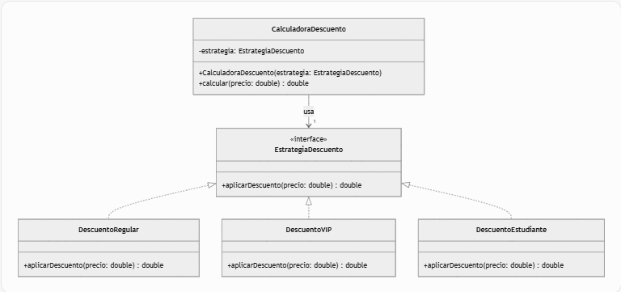
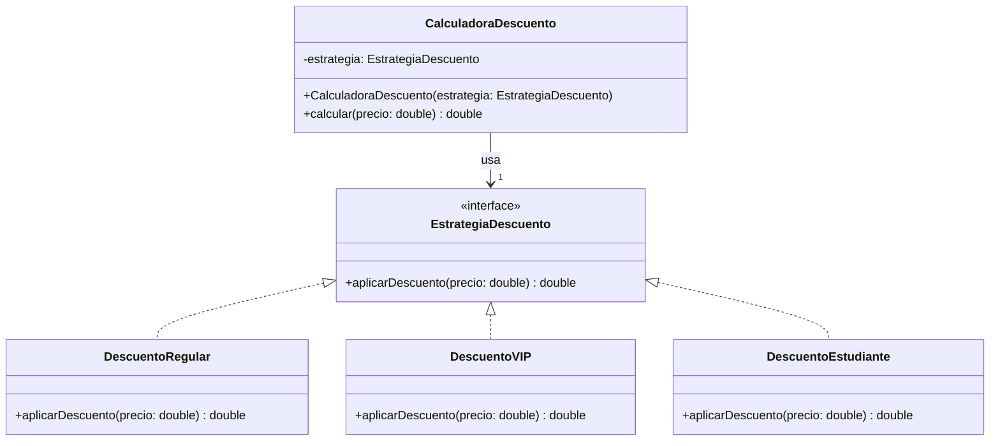

# OCP


El **Principio de Abierto/Cerrado (OCP)** establece que una clase debe estar **abierta para extensión** pero **cerrada para modificación**. Esto significa que puedes añadir nuevas funcionalidades extendiendo el código (por ejemplo, creando nuevas clases) sin modificar el código existente. En Java, esto se logra comúnmente usando interfaces, clases abstractas y polimorfismo.

A continuación, te doy un ejemplo práctico en Java que ilustra cómo aplicar el OCP.

### Ejemplo: Sistema de cálculo de descuentos
Imagina un sistema de comercio electrónico que calcula descuentos para diferentes tipos de clientes. Sin OCP, podrías tener una clase que usa condicionales para manejar diferentes tipos de descuentos, lo que requiere modificarla cada vez que añades un nuevo tipo. Con OCP, usaremos una interfaz para permitir extensiones sin modificar el código original.

#### Código sin OCP (antipatrón)
```java
class Descuento {
    public double aplicarDescuento(double precio, String tipoCliente) {
        if (tipoCliente.equals("Regular")) {
            return precio * 0.9; // 10% de descuento
        } else if (tipoCliente.equals("VIP")) {
            return precio * 0.8; // 20% de descuento
        } else if (tipoCliente.equals("Estudiante")) {
            return precio * 0.85; // 15% de descuento
        }
        return precio; // Sin descuento
    }
}
```
**Problema**: Cada vez que quieras añadir un nuevo tipo de cliente (por ejemplo, "Sénior"), necesitas modificar la clase `Descuento`, lo que viola el OCP y puede introducir errores.

#### Código con OCP
Vamos a refactorizar el código usando una interfaz y clases específicas para cada tipo de descuento, permitiendo extender el comportamiento sin modificar la clase principal.

```java
// Interfaz que define el comportamiento de los descuentos
interface EstrategiaDescuento {
    double aplicarDescuento(double precio);
}

// Clase para clientes regulares
class DescuentoRegular implements EstrategiaDescuento {
    @Override
    public double aplicarDescuento(double precio) {
        return precio * 0.9; // 10% de descuento
    }
}

// Clase para clientes VIP
class DescuentoVIP implements EstrategiaDescuento {
    @Override
    public double aplicarDescuento(double precio) {
        return precio * 0.8; // 20% de descuento
    }
}

// Clase para estudiantes
class DescuentoEstudiante implements EstrategiaDescuento {
    @Override
    public double aplicarDescuento(double precio) {
        return precio * 0.85; // 15% de descuento
    }
}

// Clase que usa la estrategia de descuento (contexto)
class CalculadoraDescuento {
    private EstrategiaDescuento estrategia;

    // Inyección de la estrategia
    public CalculadoraDescuento(EstrategiaDescuento estrategia) {
        this.estrategia = estrategia;
    }

    public double calcular(double precio) {
        return estrategia.aplicarDescuento(precio);
    }
}

// Ejemplo de uso
public class Main {
    public static void main(String[] args) {
        // Cliente regular
        CalculadoraDescuento calcRegular = new CalculadoraDescuento(new DescuentoRegular());
        System.out.println("Precio con descuento regular: " + calcRegular.calcular(100)); // 90.0

        // Cliente VIP
        CalculadoraDescuento calcVIP = new CalculadoraDescuento(new DescuentoVIP());
        System.out.println("Precio con descuento VIP: " + calcVIP.calcular(100)); // 80.0

        // Estudiante
        CalculadoraDescuento calcEstudiante = new CalculadoraDescuento(new DescuentoEstudiante());
        System.out.println("Precio con descuento estudiante: " + calcEstudiante.calcular(100)); // 85.0
    }
}
```

#### Cómo cumple con el OCP:
1. **Abierto para extensión**: Si quieres añadir un nuevo tipo de descuento, por ejemplo, para clientes "Sénior", simplemente creas una nueva clase que implemente `EstrategiaDescuento`:
   ```java
   class DescuentoSenior implements EstrategiaDescuento {
       @Override
       public double aplicarDescuento(double precio) {
           return precio * 0.75; // 25% de descuento
       }
   }
   ```
   Luego, puedes usarla sin modificar ninguna clase existente:
   ```java
   CalculadoraDescuento calcSenior = new CalculadoraDescuento(new DescuentoSenior());
   System.out.println("Precio con descuento sénior: " + calcSenior.calcular(100)); // 75.0
   ```

2. **Cerrado para modificación**: La clase `CalculadoraDescuento` no necesita cambiarse para soportar nuevos tipos de descuentos, ya que depende de la abstracción `EstrategiaDescuento`.

#### Beneficios en *Clean Code*:
- **Mantenibilidad**: Añadir nuevos descuentos no requiere tocar el código existente, reduciendo el riesgo de errores.
- **Escalabilidad**: Puedes añadir tantas estrategias de descuento como necesites sin complicar el sistema.
- **Testeabilidad**: Cada estrategia de descuento es una clase independiente, fácil de probar por separado.
- **Desacoplamiento**: La lógica de los descuentos está separada del cálculo general, siguiendo también el principio de responsabilidad única (SRP).

Este diseño utiliza el patrón **Strategy**, que es una forma común de implementar el OCP en Java. Si necesitas otro ejemplo o más detalles sobre algún aspecto, ¡avísame!


A continuación, te proporciono una descripción de un **diagrama UML de clases** para el ejemplo del **Principio de Abierto/Cerrado (OCP)** que mostré en el código de Java, relacionado con el sistema de cálculo de descuentos. Como no puedo generar directamente un diagrama visual, describiré las clases, sus relaciones y atributos en detalle, siguiendo la notación UML estándar. Puedes usar esta descripción para dibujar el diagrama en herramientas como Lucidchart, Draw.io, o cualquier editor UML. También incluiré un bloque de código con una representación textual en formato **Mermaid** (una sintaxis compatible con algunos editores para generar diagramas UML automáticamente).

### Descripción del Diagrama UML de Clases

#### Clases e Interfaces
1. **Interfaz: EstrategiaDescuento**
   - **Propósito**: Define el contrato para las estrategias de descuento.
   - **Métodos**:
     - `+aplicarDescuento(precio: double): double` (método abstracto).
   - **Relaciones**: Implementada por las clases `DescuentoRegular`, `DescuentoVIP`, `DescuentoEstudiante`, y potencialmente otras como `DescuentoSenior`.

2. **Clase: DescuentoRegular**
   - **Propósito**: Implementa la lógica de descuento para clientes regulares (10% de descuento).
   - **Métodos**:
     - `+aplicarDescuento(precio: double): double` (implementación concreta).
   - **Relaciones**: Implementa la interfaz `EstrategiaDescuento`.

3. **Clase: DescuentoVIP**
   - **Propósito**: Implementa la lógica de descuento para clientes VIP (20% de descuento).
   - **Métodos**:
     - `+aplicarDescuento(precio: double): double` (implementación concreta).
   - **Relaciones**: Implementa la interfaz `EstrategiaDescuento`.

4. **Clase: DescuentoEstudiante**
   - **Propósito**: Implementa la lógica de descuento para estudiantes (15% de descuento).
   - **Métodos**:
     - `+aplicarDescuento(precio: double): double` (implementación concreta).
   - **Relaciones**: Implementa la interfaz `EstrategiaDescuento`.

5. **Clase: CalculadoraDescuento**
   - **Propósito**: Clase de contexto que usa una estrategia de descuento para calcular el precio final.
   - **Atributos**:
     - `-estrategia: EstrategiaDescuento` (referencia a la interfaz).
   - **Métodos**:
     - `+CalculadoraDescuento(estrategia: EstrategiaDescuento)` (constructor).
     - `+calcular(precio: double): double` (método que delega el cálculo a la estrategia).
   - **Relaciones**: Tiene una **asociación** con la interfaz `EstrategiaDescuento` (depende de una instancia de la interfaz).

#### Relaciones en el Diagrama
- **Implementación**: Las clases `DescuentoRegular`, `DescuentoVIP`, y `DescuentoEstudiante` implementan la interfaz `EstrategiaDescuento`. Esto se representa con una flecha de línea discontinua con punta de flecha vacía (→◁) desde cada clase hacia la interfaz.
- **Asociación**: La clase `CalculadoraDescuento` tiene una relación de asociación con `EstrategiaDescuento`, ya que contiene una referencia a un objeto que implementa esta interfaz. Esto se representa con una línea sólida entre `CalculadoraDescuento` y `EstrategiaDescuento`, con una cardinalidad de 1 en el lado de `EstrategiaDescuento`.

#### Notación UML
- Los métodos con `+` son públicos.
- Los atributos con `-` son privados.
- La interfaz se denota con el estereotipo `<<interface>>`.

### Representación en Mermaid (para herramientas compatibles)
El siguiente código en formato **Mermaid** describe el diagrama UML. Puedes copiarlo en un editor como Mermaid Live Editor (https://mermaid.live/) para visualizar el diagrama.







### Explicación del Diagrama
- **Interfaz `EstrategiaDescuento`**: Es el núcleo del diseño, definiendo el contrato que todas las estrategias de descuento deben seguir.
- **Clases `DescuentoRegular`, `DescuentoVIP`, `DescuentoEstudiante`**: Implementan la interfaz, proporcionando diferentes comportamientos para el método `aplicarDescuento`. Esto permite extender el sistema añadiendo nuevas clases de descuento sin modificar el código existente.
- **Clase `CalculadoraDescuento`**: Actúa como el contexto que delega el cálculo del descuento a la estrategia inyectada, cumpliendo con el OCP al no necesitar modificaciones para soportar nuevos tipos de descuentos.

### Cómo Visualizarlo
1. **Manual**: Dibuja las clases como rectángulos, la interfaz con el estereotipo `<<interface>>`, y usa flechas discontinuas (→◁) para las implementaciones y una línea sólida para la asociación entre `CalculadoraDescuento` y `EstrategiaDescuento`.
2. **Herramientas**: Usa el código Mermaid en un editor compatible (como Mermaid Live Editor o plugins en VS Code) para generar el diagrama automáticamente.
3. **Alternativas**: Herramientas como Lucidchart, Draw.io, o Enterprise Architect permiten crear el diagrama UML manualmente con base en esta descripción.

### Beneficios del Diseño en el Contexto de OCP
El diagrama refleja cómo el sistema está diseñado para ser **extensible** (puedes añadir nuevas clases como `DescuentoSenior` que implementen `EstrategiaDescuento`) sin modificar las clases existentes (`CalculadoraDescuento` o la interfaz). Esto alinea el diseño con los principios de *Clean Code* y OCP.

Si necesitas ayuda para generar el diagrama en una herramienta específica, una captura visual (aunque no pueda generarla directamente), o quieres añadir más detalles (como un nuevo tipo de descuento), ¡avísame!


<br>


<br>


<br>


<br>

