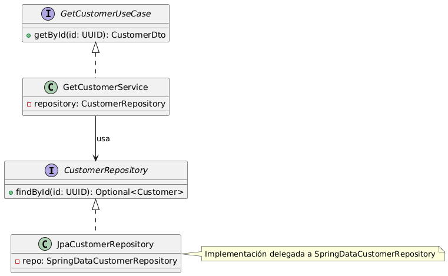
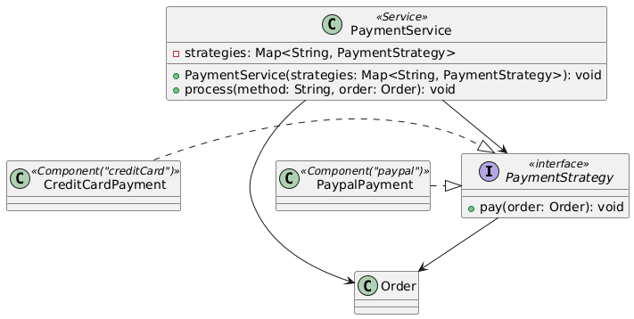

# 5 Spring Boot Patterns That Separate Senior Developers From Juniors


Que reflejan arquitectura, mantenibilidad, testabilidad y desac acoplamiento.


<br>


<br>


## 1. **Patrón Hexagonal (Ports & Adapters)**

<br>


**Clave:**  
Separar la lógica de dominio del acceso a infraestructura  
(bases de datos, APIs, colas, etc.)

### Qué hace un Senior

* Define **PUERTOS (interfaces)** para los casos de uso.
* Implementa **ADAPTADORES** concretos (DB, REST, Kafka, etc.) que dependen de esos PUERTOS.
* La capa de dominio *no depende de frameworks* (ni de Spring Data ni de controladores).

### Estructura típica:

```
/domain
  ├── model/
  ├── service/
  └── port/
       ├── in/
       └── out/
/infrastructure
  ├── adapter/
  └── repository/
/application
  └── usecase/
```

#### Ejemplo:

- Puerto de salida: CustomerRepository
- Adaptador de salida: JpaCustomerRepository
- Puerto de entrada (caso de uso): GetCustomerUseCase
- Implementación del caso de uso: GetCustomerService

```java
// Puerto de salida
public interface CustomerRepository {
    Optional<Customer> findById(UUID id);
}

// Adaptador de salida
@Repository
public class JpaCustomerRepository implements CustomerRepository {
    private final SpringDataCustomerRepository repo;
    // implementación delegada
}

// Puerto de entrada (caso de uso)
public interface GetCustomerUseCase {
    CustomerDto getById(UUID id);
}

// Implementación del caso de uso
@Service
public class GetCustomerService implements GetCustomerUseCase {
    private final CustomerRepository repository;
}
```




👉 Este patrón permite **tests unitarios puros del dominio**, sin tocar Spring.

---

## 2. **Patrón Strategy (para lógica condicional o algoritmos variables)**

**Clave:** Reemplaza cadenas de `if/else` o `switch` por comportamiento polimórfico configurable.

### Qué hace un Senior

* Define una **interfaz común**.
* Registra estrategias concretas como beans de Spring.
* Usa inyección de dependencias o un `Map<String, Strategy>` para seleccionarlas dinámicamente.

####  Ejemplo:

```java
public interface PaymentStrategy {
    void pay(Order order);
}

@Component("creditCard")
public class CreditCardPayment implements PaymentStrategy { ... }

@Component("paypal")
public class PaypalPayment implements PaymentStrategy { ... }

@Service
public class PaymentService {
    private final Map<String, PaymentStrategy> strategies;

    public PaymentService(Map<String, PaymentStrategy> strategies) {
        this.strategies = strategies;
    }

    public void process(String method, Order order) {
        strategies.get(method).pay(order);
    }
    
    public void processEnhanced(String method, Order order) {
    PaymentStrategy strategy = strategies.get(method);
    if (strategy == null) {
        throw new IllegalArgumentException("Unknown payment method: " + method);
    }
    strategy.pay(order);
}
}
```



✅ El código es extensible sin tocar el servicio (Open/Closed Principle).


#### Example Usage
Here's how you might use the PaymentProcessor class in a non-Spring context or a context where dependencies are manually wired:

```java
public class Main {
    public static void main(String[] args) {
        // Manually create payment strategies
        PaymentStrategy creditCardPayment = new CreditCardPayment();
        PaymentStrategy paypalPayment = new PaypalPayment();

        // Create a map of strategies
        Map<String, PaymentStrategy> strategies = new HashMap<>();
        strategies.put("creditCard", creditCardPayment);
        strategies.put("paypal", paypalPayment);

        // Create PaymentService with the strategy map
        PaymentService paymentService = new PaymentService(strategies);

     
        // Create an example Order
        Order order = new Order(); // Assume Order has necessary properties

		paymentService.process("creditCard", order);
    }
}
```


<br>
<br>


## 3. **Patrón Factory / Factory Method**

**Clave:** Crea instancias de objetos complejos sin acoplarte a sus constructores.

### Qué hace un Senior

* Usa *factories* para encapsular la creación de objetos con múltiples dependencias o lógica.
* Facilita testing, validación, y desacopla controladores o servicios de la construcción de entidades.

### Ejemplo:

```java
@Component
public class OrderFactory {
    public Order createFromRequest(OrderRequest request) {
        return new Order(UUID.randomUUID(), request.getCustomerId(), request.getItems());
    }
}
```

✅ Evita `new` dentro de controladores o servicios → **inyección de dependencias limpia**.

<br>
<br>


## 4. **Patrón Specification (Domain Predicate Pattern)**

**Clave:** Evita lógica condicional compleja en filtros de negocio y consultas.

### 💡 Qué hace un Senior

* Encapsula las reglas de negocio como **“especificaciones”** reutilizables.
* Permite combinar condiciones (`and`, `or`, `not`) fácilmente.
* Se integra con JPA (`Specification<T>`).

### Ejemplo:

```java
public class CustomerSpecifications {
    public static Specification<Customer> isActive() {
        return (root, query, cb) -> cb.isTrue(root.get("active"));
    }
    public static Specification<Customer> hasAgeAbove(int age) {
        return (root, query, cb) -> cb.gt(root.get("age"), age);
    }
}

// Uso:
repository.findAll(where(isActive()).and(hasAgeAbove(30)));
```

✅ Separa **reglas de negocio reutilizables** del código de persistencia.


<br>
<br>


## 🚀 5. **Patrón Observer / Event-Driven (Domain Events)**

**➡️ Clave:** Desacopla módulos con *eventos de dominio* usando Spring Events o mensajería (Kafka, RabbitMQ).

### 💡 Qué hace un Senior

* Usa `ApplicationEventPublisher` o `@EventListener`.
* Modela eventos del dominio (“OrderCreated”, “UserRegistered”) en vez de eventos técnicos.

### 🧠 Ejemplo:

```java
// Evento de dominio
public record OrderCreatedEvent(UUID orderId) {}

// Publicador
@Service
public class OrderService {
    private final ApplicationEventPublisher publisher;

    public void createOrder(Order order) {
        // guardar order ...
        publisher.publishEvent(new OrderCreatedEvent(order.getId()));
    }
}

// Oyente
@Component
public class SendConfirmationListener {
    @EventListener
    public void onOrderCreated(OrderCreatedEvent event) {
        // enviar email
    }
}
```

✅ Desacopla flujos sin necesidad de llamar métodos directos.


<br>
<br>

<br>
<br>


##  Resumen visual

| Patrón             | Propósito                           | Beneficio principal                | Nivel             |
| ------------------ | ----------------------------------- | ---------------------------------- | ----------------- |
| **Hexagonal**      | Separar dominio e infraestructura   | Alta mantenibilidad y testabilidad | 🧠 Senior         |
| **Strategy**       | Reemplazar if/else por polimorfismo | Código extensible, limpio          | 🧩 Senior         |
| **Factory**        | Encapsular creación de objetos      | Cohesión y claridad                | ⚙️ Medio–Avanzado |
| **Specification**  | Componer reglas de negocio          | Reutilización de lógica            | 🧠 Senior         |
| **Observer/Event** | Comunicación desacoplada            | Escalabilidad y modularidad        | 🚀 Senior         |

---

¿Querés que te muestre cómo combinar **Hexagonal + Event-Driven** en un microservicio real de Spring Boot (por ejemplo, un flujo `Order → Payment → Notification`)?
