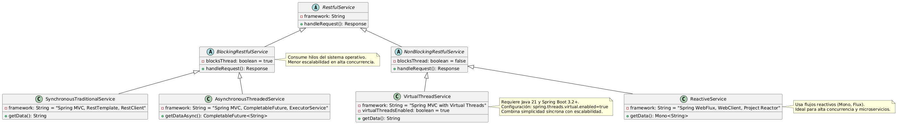

# Clasificación de los Servicios RESTful


A continuación, te proporciono una **descripción detallada** de un gráfico de clasificación para los tipos de servicios RESTful en el contexto de **Spring Boot** y **Java 21**, diferenciando entre **bloqueantes** y **no bloqueantes**, junto con las librerías o frameworks que resuelven cada subdivisión. Dado que no puedo generar gráficos directamente, describiré el diseño del gráfico (como una tabla o estructura jerárquica) y proporcionaré el código necesario para visualizarlo usando una librería como **JFreeChart** o una representación en texto (ASCII o Markdown) para que sea clara. También incluiré las tecnologías relevantes y cómo se relacionan con **Virtual Threads** de Java 21, ya que mencionaste su uso en servicios RESTful.

---

### **Estructura del Gráfico de Clasificación**

El gráfico clasifica los servicios RESTful en **Spring Boot** según su naturaleza (**bloqueante** o **no bloqueante**) y las subdivisiones dentro de cada tipo, identificando las librerías o frameworks que los implementan. La estructura se puede representar como una **tabla** o un **diagrama jerárquico**.

#### **Clasificación**
1. **Servicios RESTful Bloqueantes**:
   - Características: Cada solicitud HTTP consume un hilo del sistema operativo durante toda su ejecución, incluyendo operaciones de I/O (como consultas a bases de datos o llamadas externas). Esto puede limitar la escalabilidad en escenarios de alta concurrencia.
   - Subdivisiones:
     - **Síncronos Tradicionales**: Usan un modelo de un hilo por solicitud, bloqueando el hilo hasta que la operación completa.
     - **Asíncronos con Hilos Dedicados**: Usan hilos gestionados manualmente (por ejemplo, `ExecutorService`) para liberar el hilo principal, pero aún dependen de hilos del sistema operativo.
   - Tecnologías asociadas:
     - **RestTemplate** (Spring, bloqueante, síncrono).
     - **RestClient** (Spring 6+, bloqueante, síncrono, API fluida).
     - **Spring MVC** con `@RestController` (bloqueante por defecto, síncrono).
     - **ExecutorService** o `CompletableFuture` para asincronía manual.

2. **Servicios RESTful No Bloqueantes**:
   - Características: No bloquean los hilos durante operaciones de I/O, utilizando un modelo basado en eventos (event-loop) o hilos virtuales para maximizar la escalabilidad.
   - Subdivisiones:
     - **Reactivos**: Basados en programación reactiva, usando flujos como `Mono` y `Flux` (Project Reactor).
     - **Asíncronos con Virtual Threads**: Usan los Virtual Threads de Java 21 para manejar solicitudes de forma síncrona pero con alta concurrencia, sin bloquear hilos del sistema operativo.
   - Tecnologías asociadas:
     - **WebClient** (Spring WebFlux, no bloqueante, reactivo).
     - **Spring WebFlux** con `@RestController` (no bloqueante, reactivo).
     - **Spring MVC** con Virtual Threads (Spring Boot 3.2+, bloqueante en estilo síncrono pero escalable con Virtual Threads).
     - **Project Reactor** (base para WebFlux, proporciona `Mono` y `Flux`).

#### **Relación con Virtual Threads**
- Los **Virtual Threads** (Java 21, JEP 444) permiten que los servicios RESTful bloqueantes escritos en estilo síncrono (por ejemplo, con Spring MVC) escalen como si fueran no bloqueantes, ya que la JVM gestiona miles de hilos virtuales con bajo overhead.
- En Spring Boot 3.2+, puedes habilitar Virtual Threads para que Spring MVC asigne un hilo virtual por solicitud, combinando la simplicidad del código síncrono con la escalabilidad de los modelos no bloqueantes.

---

### **Representación del Gráfico en Markdown**

A continuación, presento una tabla que representa el gráfico de clasificación, ya que es una forma clara y portátil de visualizar la estructura:

```markdown
# Clasificación de Servicios RESTful en Spring Boot con Java 21

| Tipo de Servicio | Subdivisión | Características | Librerías/Frameworks | Ejemplo de Uso |
|------------------|-------------|-----------------|----------------------|----------------|
| **Bloqueante**   | Síncronos Tradicionales | Un hilo por solicitud, bloquea durante I/O | Spring MVC, RestTemplate, RestClient | `@RestController` con métodos síncronos, `RestTemplate.getForObject()` |
|                  | Asíncronos con Hilos Dedicados | Usa hilos gestionados para liberar el hilo principal | Spring MVC con `CompletableFuture`, `ExecutorService` | `@Async` con `CompletableFuture.supplyAsync()` |
| **No Bloqueante**| Reactivos | Basado en flujos reactivos (`Mono`, `Flux`), event-loop | Spring WebFlux, WebClient, Project Reactor | `@RestController` en WebFlux, `WebClient.get().retrieve()` |
|                  | Asíncronos con Virtual Threads | Código síncrono, escalable con hilos virtuales | Spring MVC con Virtual Threads (Spring Boot 3.2+) | `@RestController` con `spring.threads.virtual.enabled=true` |

```

#### **Notas sobre la Tabla**
- **Spring MVC** puede operar en modo bloqueante (tradicional) o no bloqueante (con Virtual Threads o `@Async`).
- **Spring WebFlux** es inherentemente no bloqueante y reactivo, ideal para aplicaciones con alta concurrencia y operaciones I/O intensivas.
- **RestClient** (Spring 6+) reemplaza a `RestTemplate` con una API más moderna, pero sigue siendo bloqueante.
- **WebClient** es la opción no bloqueante para realizar llamadas HTTP externas en aplicaciones reactivas.

---

### **Código para Generar un Gráfico con JFreeChart**

Si deseas generar un gráfico visual (por ejemplo, un diagrama de árbol o una tabla interactiva), puedes usar **JFreeChart** o una librería similar. A continuación, te proporciono un ejemplo de código para crear un **diagrama jerárquico** que represente la clasificación usando JFreeChart. Este código genera una ventana con un diagrama de árbol simplificado.

#### **Dependencias**
Agrega JFreeChart al archivo `pom.xml` de tu proyecto Spring Boot:

```xml
<dependency>
    <groupId>org.jfree</groupId>
    <artifactId>jfreechart</artifactId>
    <version>1.5.4</version>
</dependency>
```

#### **Código Java**

```java
import org.jfree.chart.ChartFactory;
import org.jfree.chart.ChartPanel;
import org.jfree.chart.JFreeChart;
import org.jfree.data.category.DefaultCategoryDataset;
import javax.swing.JFrame;

public class RestfulServicesChart extends JFrame {

    public RestfulServicesChart() {
        // Crear dataset para el gráfico
        DefaultCategoryDataset dataset = new DefaultCategoryDataset();
        
        // Bloqueantes
        dataset.addValue(1, "Bloqueante", "Síncronos Tradicionales (Spring MVC, RestTemplate)");
        dataset.addValue(2, "Bloqueante", "Asíncronos con Hilos (CompletableFuture)");
        
        // No Bloqueantes
        dataset.addValue(3, "No Bloqueante", "Reactivos (WebFlux, WebClient)");
        dataset.addValue(4, "No Bloqueante", "Virtual Threads (Spring MVC + Java 21)");

        // Crear gráfico de barras
        JFreeChart chart = ChartFactory.createBarChart(
            "Clasificación de Servicios RESTful en Spring Boot (Java 21)",
            "Subdivisión",
            "Índice",
            dataset
        );

        // Crear panel y mostrar
        ChartPanel chartPanel = new ChartPanel(chart);
        chartPanel.setPreferredSize(new java.awt.Dimension(800, 600));
        setContentPane(chartPanel);
    }

    public static void main(String[] args) {
        RestfulServicesChart chart = new RestfulServicesChart();
        chart.pack();
        chart.setTitle("Clasificación de Servicios RESTful");
        chart.setDefaultCloseOperation(JFrame.EXIT_ON_CLOSE);
        chart.setVisible(true);
    }
}
```

#### **Explicación del Código**
- **Dataset**: Se crea un `DefaultCategoryDataset` con las categorías "Bloqueante" y "No Bloqueante", y se asignan valores para cada subdivisión.
- **Gráfico de Barras**: Usamos `ChartFactory.createBarChart` para generar un gráfico de barras que muestra las subdivisiones. Cada barra representa una subdivisión, agrupada por tipo de servicio.
- **Visualización**: El gráfico se muestra en una ventana Swing (`JFrame`).

#### **Resultado**
El gráfico mostrará dos grupos de barras:
- **Bloqueante**: Dos barras para "Síncronos Tradicionales" y "Asíncronos con Hilos".
- **No Bloqueante**: Dos barras para "Reactivos" y "Virtual Threads".

---

### **Ejemplo de Uso en Spring Boot**

Para ilustrar cómo se implementan estas subdivisiones, aquí hay ejemplos breves de código para cada una:

1. **Bloqueante - Síncronos Tradicionales (Spring MVC + RestClient)**:
```java
@RestController
@RequestMapping("/api")
public class BlockingController {
    @Autowired
    private RestClient restClient;

    @GetMapping("/data")
    public String getData() {
        // Bloqueante: espera la respuesta
        return restClient.get()
            .uri("https://api.example.com/data")
            .retrieve()
            .body(String.class);
    }
}
```

2. **Bloqueante - Asíncronos con Hilos (Spring MVC + CompletableFuture)**:
```java
@RestController
@RequestMapping("/api")
public class AsyncBlockingController {
    @Autowired
    private RestClient restClient;

    @GetMapping("/data")
    public CompletableFuture<String> getData() {
        return CompletableFuture.supplyAsync(() -> {
            // Ejecutado en un hilo separado
            return restClient.get()
                .uri("https://api.example.com/data")
                .retrieve()
                .body(String.class);
        });
    }
}
```

3. **No Bloqueante - Reactivos (Spring WebFlux + WebClient)**:
```java
@RestController
@RequestMapping("/api")
public class ReactiveController {
    @Autowired
    private WebClient webClient;

    @GetMapping("/data")
    public Mono<String> getData() {
        // No bloqueante: usa flujos reactivos
        return webClient.get()
            .uri("https://api.example.com/data")
            .retrieve()
            .bodyToMono(String.class);
    }
}
```

4. **No Bloqueante - Virtual Threads (Spring MVC + Java 21)**:
```java
@RestController
@RequestMapping("/api")
public class VirtualThreadController {
    @Autowired
    private RestClient restClient;

    @GetMapping("/data")
    public String getData() {
        // Síncrono, pero usa Virtual Threads (configurado en application.properties)
        return restClient.get()
            .uri("https://api.example.com/data")
            .retrieve()
            .body(String.class);
    }
}
```
**Configuración en `application.properties`**:
```properties
spring.threads.virtual.enabled=true
```

---

### **Resumen y Recomendaciones**
- **Cuándo usar cada tipo**:
  - **Bloqueante (Síncronos)**: Ideal para aplicaciones simples con baja concurrencia o donde la simplicidad del código es prioritaria.
  - **Bloqueante (Asíncronos)**: Útil para operaciones largas que no justifican un cambio a reactivo, pero requieren liberar el hilo principal.
  - **No Bloqueante (Reactivos)**: Recomendado para aplicaciones con alta concurrencia, microservicios, o donde el rendimiento es crítico.
  - **No Bloqueante (Virtual Threads)**: Perfecto para combinar la simplicidad del código síncrono con la escalabilidad de los modelos no bloqueantes, especialmente en Java 21.
- **Integración con Java 21**: Los Virtual Threads hacen que Spring MVC sea una opción viable para alta concurrencia sin adoptar el modelo reactivo, reduciendo la complejidad en muchos casos.
- **Visualización**: La tabla Markdown es portátil y clara. Si necesitas un gráfico interactivo, el código JFreeChart genera una visualización básica que puedes personalizar (por ejemplo, cambiar a un diagrama de árbol con una librería como **XChart**).

Si deseas un formato diferente (por ejemplo, un diagrama UML, un gráfico en HTML con Chart.js, o más detalles sobre alguna subdivisión), o si quieres que profundice en un ejemplo específico, ¡avísame! También puedo ayudarte a integrar el gráfico en una aplicación Spring Boot si lo necesitas.


---


.  

.  

.  


# Explicación en un Diagrama UML





Dado que deseas un **diagrama UML** para clasificar los tipos de servicios RESTful en el contexto de **Spring Boot** y **Java 21**, voy a diseñar un **diagrama de clases UML** que represente la clasificación de servicios RESTful (**bloqueantes** y **no bloqueantes**) y sus subdivisiones, junto con las librerías/frameworks asociados. Como no puedo generar imágenes directamente, proporcionaré una descripción detallada del diagrama en formato texto usando una notación estándar (como PlantUML) y explicaré cómo visualizarlo. También incluiré la relación con **Virtual Threads** y ejemplos de implementación en Spring Boot.

---

### **Descripción del Diagrama UML**

El diagrama UML será un **diagrama de clases** que modele:
- Una clase abstracta raíz (`RestfulService`) que representa todos los servicios RESTful.
- Dos clases abstractas derivadas: `BlockingRestfulService` y `NonBlockingRestfulService`.
- Clases concretas para cada subdivisión:
  - **Bloqueantes**: `SynchronousTraditionalService`, `AsynchronousThreadedService`.
  - **No Bloqueantes**: `ReactiveService`, `VirtualThreadService`.
- Relaciones de **generalización** (herencia) entre las clases.
- Atributos que indiquen las librerías/frameworks utilizados.
- Métodos representativos para cada tipo de servicio.
- Notas para aclarar el uso de **Virtual Threads** y la configuración en Spring Boot.

---

### **Código PlantUML**

A continuación, presento el código en **PlantUML**, una herramienta que permite generar diagramas UML a partir de texto. Puedes copiar este código y pegarlo en un editor como **PlantUML Web Server** (http://www.plantuml.com/plantuml/) o usar una extensión en tu IDE (como IntelliJ con el plugin PlantUML) para visualizar el diagrama.

```plantuml
@startuml
' Diagrama UML para Clasificación de Servicios RESTful en Spring Boot con Java 21

' Clase abstracta raíz
abstract class RestfulService {
  +handleRequest(): Response
  -framework: String
}

' Clases abstractas para tipos principales
abstract class BlockingRestfulService {
  -blocksThread: boolean = true
  +handleRequest(): Response
}

abstract class NonBlockingRestfulService {
  -blocksThread: boolean = false
  +handleRequest(): Response
}

' Subdivisiones de Bloqueantes
class SynchronousTraditionalService {
  -framework: String = "Spring MVC, RestTemplate, RestClient"
  +getData(): String
}

class AsynchronousThreadedService {
  -framework: String = "Spring MVC, CompletableFuture, ExecutorService"
  +getDataAsync(): CompletableFuture<String>
}

' Subdivisiones de No Bloqueantes
class ReactiveService {
  -framework: String = "Spring WebFlux, WebClient, Project Reactor"
  +getData(): Mono<String>
}

class VirtualThreadService {
  -framework: String = "Spring MVC with Virtual Threads"
  -virtualThreadsEnabled: boolean = true
  +getData(): String
}

' Relaciones de herencia
RestfulService <|-- BlockingRestfulService
RestfulService <|-- NonBlockingRestfulService
BlockingRestfulService <|-- SynchronousTraditionalService
BlockingRestfulService <|-- AsynchronousThreadedService
NonBlockingRestfulService <|-- ReactiveService
NonBlockingRestfulService <|-- VirtualThreadService

' Notas explicativas
note right of VirtualThreadService
  Requiere Java 21 y Spring Boot 3.2+.
  Configuración: spring.threads.virtual.enabled=true
  Combina simplicidad síncrona con escalabilidad.
end note

note right of ReactiveService
  Usa flujos reactivos (Mono, Flux).
  Ideal para alta concurrencia y microservicios.
end note

note right of BlockingRestfulService
  Consume hilos del sistema operativo.
  Menor escalabilidad en alta concurrencia.
end note

@enduml
```



---

### **Explicación del Diagrama**

1. **Clase Raíz: `RestfulService`**:
   - **Atributos**: `framework` (indica el framework o librería usado, como Spring MVC o WebFlux).
   - **Métodos**: `handleRequest(): Response` (método abstracto para procesar solicitudes REST).
   - Representa la abstracción de cualquier servicio RESTful.

2. **Clases Abstractas: `BlockingRestfulService` y `NonBlockingRestfulService`**:
   - **BlockingRestfulService**:
     - Atributo: `blocksThread: boolean = true` (indica que bloquea hilos del sistema operativo).
     - Nota: Menor escalabilidad en alta concurrencia.
   - **NonBlockingRestfulService**:
     - Atributo: `blocksThread: boolean = false` (no bloquea hilos durante I/O).
     - Representa servicios optimizados para concurrencia.

3. **Subdivisiones de Bloqueantes**:
   - **SynchronousTraditionalService**:
     - Atributo: `framework: String = "Spring MVC, RestTemplate, RestClient"`.
     - Método: `getData(): String` (representa una llamada síncrona bloqueante).
     - Ejemplo: Controladores REST con `@RestController` que usan `RestTemplate` o `RestClient`.
   - **AsynchronousThreadedService**:
     - Atributo: `framework: String = "Spring MVC, CompletableFuture, ExecutorService"`.
     - Método: `getDataAsync(): CompletableFuture<String>` (usa hilos gestionados para asincronía).
     - Ejemplo: Métodos con `@Async` o `CompletableFuture`.

4. **Subdivisiones de No Bloqueantes**:
   - **ReactiveService**:
     - Atributo: `framework: String = "Spring WebFlux, WebClient, Project Reactor"`.
     - Método: `getData(): Mono<String>` (usa flujos reactivos).
     - Nota: Ideal para alta concurrencia y microservicios.
     - Ejemplo: Controladores WebFlux con `WebClient`.
   - **VirtualThreadService**:
     - Atributo: `framework: String = "Spring MVC with Virtual Threads"`.
     - Atributo: `virtualThreadsEnabled: boolean = true` (indica uso de Virtual Threads).
     - Método: `getData(): String` (síncrono pero escalable).
     - Nota: Requiere Java 21 y `spring.threads.virtual.enabled=true`.

5. **Relaciones**:
   - **Generalización** (herencia): Representada por flechas (`<|--`) que conectan las clases derivadas con sus clases base.
   - Las notas proporcionan contexto adicional sobre la configuración y casos de uso.

---

### **Cómo Visualizar el Diagrama**

1. **Usando PlantUML Online**:
   - Copia el código PlantUML proporcionado.
   - Pégalo en http://www.plantuml.com/plantuml/ o en un editor compatible.
   - Generará un diagrama de clases con las relaciones, clases, atributos, métodos y notas.

2. **Usando un IDE**:
   - Instala un plugin de PlantUML (por ejemplo, en IntelliJ IDEA o VS Code).
   - Crea un archivo `.puml` con el código y visualízalo directamente.

3. **Alternativa Manual**:
   - Si no puedes usar PlantUML, la descripción en Markdown de la sección anterior (tabla) sirve como una representación textual clara de la clasificación.

---

### **Ejemplos de Implementación en Spring Boot**

Para conectar el diagrama UML con la práctica, aquí hay ejemplos de código para cada clase concreta del diagrama:

1. **SynchronousTraditionalService**:
```java
@RestController
@RequestMapping("/api")
public class SynchronousTraditionalService {
    private final RestClient restClient = RestClient.create();

    @GetMapping("/data")
    public String getData() {
        return restClient.get()
            .uri("https://api.example.com/data")
            .retrieve()
            .body(String.class); // Bloqueante
    }
}
```

2. **AsynchronousThreadedService**:
```java
@RestController
@RequestMapping("/api")
public class AsynchronousThreadedService {
    private final RestClient restClient = RestClient.create();

    @GetMapping("/data")
    public CompletableFuture<String> getDataAsync() {
        return CompletableFuture.supplyAsync(() -> {
            return restClient.get()
                .uri("https://api.example.com/data")
                .retrieve()
                .body(String.class);
        });
    }
}
```

3. **ReactiveService**:
```java
@RestController
@RequestMapping("/api")
public class ReactiveService {
    private final WebClient webClient = WebClient.create();

    @GetMapping("/data")
    public Mono<String> getData() {
        return webClient.get()
            .uri("https://api.example.com/data")
            .retrieve()
            .bodyToMono(String.class); // No bloqueante
    }
}
```

4. **VirtualThreadService**:
```java
@RestController
@RequestMapping("/api")
public class VirtualThreadService {
    private final RestClient restClient = RestClient.create();

    @GetMapping("/data")
    public String getData() {
        return restClient.get()
            .uri("https://api.example.com/data")
            .retrieve()
            .body(String.class); // Síncrono, pero con Virtual Threads
    }
}
```
**Configuración en `application.properties`**:
```properties
spring.threads.virtual.enabled=true
```

---

### **Resumen y Notas Adicionales**

- **Propósito del Diagrama**: El diagrama UML clasifica los servicios RESTful en Spring Boot, destacando cómo los **Virtual Threads** (Java 21) permiten que los servicios síncronos (`VirtualThreadService`) alcancen una escalabilidad comparable a los reactivos (`ReactiveService`) con un código más simple.
- **Visualización**: Usa el código PlantUML para generar el diagrama. Si necesitas una alternativa (por ejemplo, un archivo SVG o PNG), puedo guiarte para exportarlo desde PlantUML.
- **Relación con Java 21**: Los Virtual Threads son clave para la clase `VirtualThreadService`, ya que hacen que Spring MVC sea viable para alta concurrencia sin adoptar el modelo reactivo.
- **Extensibilidad**: Puedes ampliar el diagrama añadiendo más atributos (por ejemplo, métricas de rendimiento) o métodos específicos.

Si necesitas que modifique el diagrama (por ejemplo, agregar más detalles, cambiar a un diagrama de componentes o secuencia), que genere el archivo gráfico en un formato específico, o que profundice en algún aspecto del código, ¡dímelo! También puedo ayudarte a integrar el diagrama en una aplicación Spring Boot o generar documentación adicional.