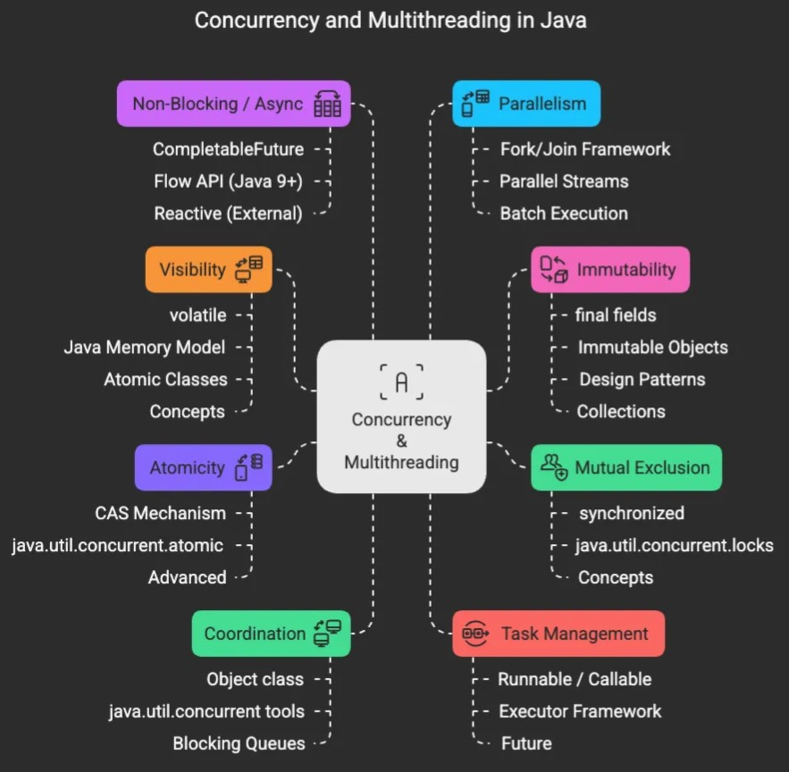
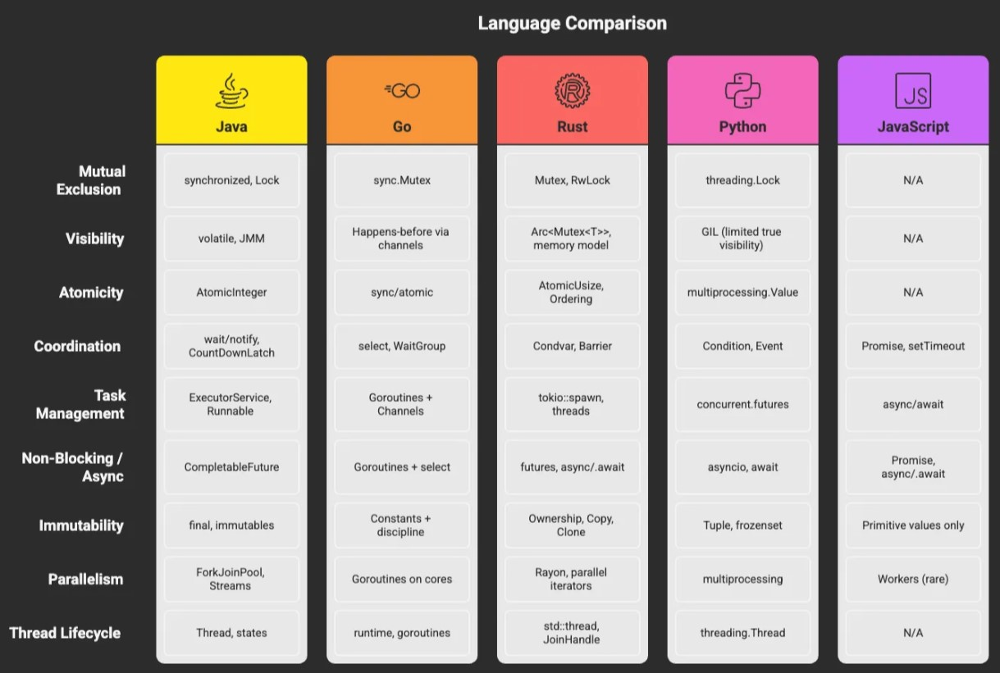
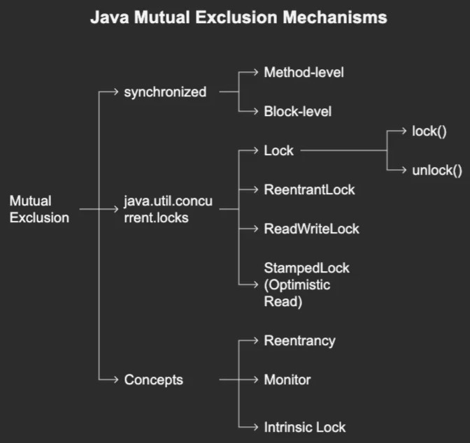

# The Ultimate Java Concurrency & Multithreading Roadmap

<br>

#### ref:

https://medium.com/javarevisited/the-concurrency-multithreading-bible-for-engineers-642d2c5c3a02


<br>


>
Fig. 1: The Ultimate Concurrency & Multithreading Roadmap


<br>

This doc is the result of months of ruthless research, battle-tested debugging, and cross-language insights — centered around Java, but deeply inspired by:

- C++11’s atomic ordering
- Golang’s CSP-style coordination
- Rust’s ownership safety model
- Python’s GIL-cooperative concurrency
- JavaScript’s async event loop

Despite syntax differences, I realized the conceptual foundations were repeating.

What emerged was a **unifying model of concurrency** — the 9 Pillars. 
A **programmer’s Bible** for writing safe, performant, and robust concurrent systems.

## No Matter Your Language

You may write Java today and Rust tomorrow. You may move from Spring Boot to serverless Lambda functions.

But the moment you deal with threads, cores, parallel requests, or shared memory — **these 9 pillars show up**.

Here’s why:

- **Mutual exclusion** — Ensures correctness when state is shared.
- **Visibility** — Guarantees other threads see your changes.
- **Atomicity** — Prevents race conditions at the bytecode level.
- **Coordination** — Lets threads talk, wait, and sync up.
- **Task management** — Orchestrate work efficiently with thread pools.
- **Non-blocking async** — Helps you scale without blocking.
- **Immutability** — Eliminates whole categories of bugs.
- **Parallelism** — Lets you scale across cores.
- **Thread lifecycle** — Master the states: NEW → TERMINATED.

### Ignore these at your own risk.

Every crash in production, every deadlock, every flaky test that “works on my machine” — is a violation of one or more of these pillars.


## The Pillars (Preview)

Here’s the bird’s-eye view of the mind map we’ll explore:

```
Concurrency & Multithreading
│
├── 1. Mutual Exclusion        → Locking, reentrancy, intrinsic monitors
├── 2. Visibility              → Volatile, memory model, happens-before
├── 3. Atomicity               → Compare-and-swap, atomic primitives
├── 4. Coordination            → wait/notify, latches, semaphores
├── 5. Task Management         → Runnable, ExecutorService, Future
├── 6. Non-Blocking / Async    → CompletableFuture, reactive streams
├── 7. Immutability            → final fields, value objects, collections
├── 8. Parallelism             → Fork/Join, Streams, Spliterators
└── 9. Thread Lifecycle        → States, interrupt, daemon, priority
```

This is not just a list — it’s a **mental model**.

While this series deep-dives into Java APIs (like synchronized, CompletableFuture, and ExecutorService), you’ll notice how these concepts echo in Go’s goroutines, Rust’s tokio, or Node.js’s event loop. That’s intentional. The goal is to build a reusable mental model.

Everything you study in concurrency maps to one or more of these buckets.

From simple locks to advanced reactive programming — **it all fits here**.


## The Mind Map (In Detail)

```
Concurrency & Multithreading
│
├── 1. Mutual Exclusion
│   ├── synchronized
│   │   ├── Method-level
│   │   └── Block-level
│   ├── java.util.concurrent.locks
│   │   ├── Lock
│   │   │   ├── lock()
│   │   │   └── unlock()
│   │   ├── ReentrantLock
│   │   ├── ReadWriteLock
│   │   └── StampedLock (Optimistic Read)
│   └── Concepts
│       └── Reentrancy, Monitor, Intrinsic Lock
│
├── 2. Visibility
│   ├── volatile
│   ├── Java Memory Model
│   │   └── Happens-before
│   ├── Atomic Classes
│   │   ├── AtomicInteger
│   │   ├── AtomicLong
│   │   ├── AtomicBoolean
│   │   └── AtomicReference
│   └── Concepts
│       └── Cache Coherence, Reordering Prevention
│
├── 3. Atomicity
│   ├── CAS Mechanism (Compare-And-Swap)
│   ├── java.util.concurrent.atomic
│   │   ├── get(), set()
│   │   ├── compareAndSet()
│   │   └── incrementAndGet()
│   ├── Advanced Counters
│   │   ├── LongAdder
│   │   └── DoubleAccumulator
│   └── Unsafe (sun.misc.Unsafe) [low-level ops]
│
├── 4. Coordination
│   ├── Object class
│   │   ├── wait()
│   │   ├── notify()
│   │   └── notifyAll()
│   ├── java.util.concurrent tools
│   │   ├── CountDownLatch
│   │   ├── CyclicBarrier
│   │   ├── Semaphore
│   │   ├── Exchanger
│   │   └── Phaser
│   ├── Blocking Queues
│   │   ├── BlockingQueue
│   │   ├── SynchronousQueue
│   │   └── DelayQueue
│   └── Thread Coordination
│       ├── join()
│       ├── sleep()
│       └── yield()
│
├── 5. Task Management
│   ├── Runnable / Callable
│   ├── Executor Framework
│   │   ├── Executors (factory)
│   │   │   ├── newFixedThreadPool()
│   │   │   ├── newCachedThreadPool()
│   │   │   ├── newSingleThreadExecutor()
│   │   │   └── newScheduledThreadPool()
│   │   └── ExecutorService
│   │       ├── submit()
│   │       ├── shutdown()
│   │       ├── awaitTermination()
│   │       ├── invokeAll()
│   │       └── invokeAny()
│   └── Future
│       ├── get()
│       ├── cancel()
│       └── isDone()
│
├── 6. Non-Blocking / Async
│   ├── CompletableFuture
│   │   ├── supplyAsync()
│   │   ├── thenApply(), thenAccept(), thenCombine()
│   │   ├── allOf(), anyOf()
│   │   └── exceptionally(), whenComplete()
│   ├── Flow API (Java 9+)
│   │   ├── Publisher
│   │   ├── Subscriber
│   │   ├── Processor
│   │   └── Subscription
│   └── Reactive Libraries
│       ├── Project Reactor
│       └── RxJava
│
├── 7. Immutability
│   ├── final keyword
│   ├── Immutable Class Design
│   │   ├── Constructor-only state
│   │   ├── All fields final
│   │   └── No setters
│   ├── Design Patterns
│   │   ├── Builder Pattern
│   │   └── Value Object
│   └── Collections (Java 9+)
│       ├── List.of()
│       ├── Set.of()
│       └── Map.of()
│
├── 8. Parallelism
│   ├── Fork/Join Framework
│   │   ├── ForkJoinPool
│   │   ├── RecursiveTask
│   │   └── RecursiveAction
│   ├── Parallel Streams
│   │   ├── .parallelStream()
│   │   └── .map(), .reduce(), .collect()
│   ├── Spliterator (advanced)
│   └── Batch Execution
│       └── invokeAll(List<Callable<T>>)
│
└── 9. Thread Lifecycle / Management
    ├── Thread class
    │   ├── start(), run()
    │   ├── interrupt(), isInterrupted()
    │   ├── setDaemon(), setPriority()
    ├── Thread States
    │   ├── NEW
    │   ├── RUNNABLE
    │   ├── BLOCKED
    │   ├── WAITING
    │   ├── TIMED_WAITING
    │   └── TERMINATED
    ├── ThreadFactory
    └── ThreadGroup (legacy)
```	


	
## How These Concepts Map Across Languages


>
Fig. 2: Concepts map across Languages.

<br>

## What Happens Next
This is not the end — this is the framework.

Next, we will deep-dive into each pillar — one blog post at a time.

We’ll demystify:

- **Why synchronized isn’t enough**
- **Why volatile is misunderstood**
- **What CAS really does under the hood**
- **How to use CountDownLatch like a pro**
- **How CompletableFuture’s DAG model works**
- **Why immutability is a concurrency hack**  

*And much more...*

Each blog will include:

- Visuals & mental models
- Java code snippets
- Cross-language examples
- Gotchas from production
- Interview-grade breakdowns

## Who Is This For?

Engineers preparing for Google, Meta, Netflix, or high-performance backend roles
Leads & Architects designing scalable systems
Interview candidates tired of memorizing fragmented concurrency trivia
Anyone who wants to build real, safe, and scalable concurrent systems


<br>
<br>
<br>

---

<br>
<br>


# All Pillar Deep-Dives:

🔐 [Mutual Exclusion: The First Law of Thread Civilization 👉 Click to dive in](https://medium.com/javarevisited/mutual-exclusion-the-first-law-of-thread-civilization-48f25a7789b2)  

👀 [Visibility: The Hidden Force That Breaks or Builds Your Code 👉 Click to explore](https://medium.com/javarevisited/visibility-the-hidden-force-that-breaks-or-builds-your-code-c8bb14e9dbd2)  

⚔️ [Atomicity: Your Final Defense Against Race Conditions 👉 Read now](https://medium.com/javarevisited/%EF%B8%8F-atomicity-your-final-defense-against-race-conditions-4bb87b577631)  

🕸️ [Coordination: Making Threads Work Together, Not Collide 👉 See how it works](https://medium.com/javarevisited/%EF%B8%8F-coordination-making-threads-work-together-not-collide-fe74f790063a)  

🧠 [Task Management: Thread Creation is Dead, Long Live the Executor 👉 Learn the strategy](https://medium.com/javarevisited/task-management-thread-creation-is-dead-long-live-the-executor-e83508c5f150)  

⚡ [Non-Blocking & Async: The Future Has No wait() 👉 Understand async flows](https://nikhiltiwari005.medium.com/non-blocking-async-the-future-has-no-wait-4011b38041d9)  

🧱 [Immutability — Thread Safety Without the Locks 👉 See why it’s magic](https://nikhiltiwari005.medium.com/immutability-thread-safety-without-the-locks-6aefbb413c56)  

🧮 [Parallelism — Exploiting All Cores Like a Pro 👉 Read now](https://nikhiltiwari005.medium.com/parallelism-exploiting-all-cores-like-a-pro-e127ddc1ff68)  

🧵 [Thread Lifecycle & Management — The Final Pillar 👉 Final piece of puzzle](https://nikhiltiwari005.medium.com/thread-lifecycle-management-the-final-pillar-32c976c5b56e)  


<br>
<br>
<br>

---

---

<br>
<br>
<br>


# 🔐 
# Mutual Exclusion: 
# The First Law of Thread Civilization

<br>


Imagine you’re sharing a bank locker with three roommates. 
You all trust each other, but you only have one key.  
Why? Because if everyone accessed the locker at the same time, it would lead to utter chaos — stuff might get stolen, broken, or lost.  
That **key** is what we call **mutual exclusion** in the world of multithreading.


## What Is Mutual Exclusion?

In a multithreaded system, **Mutual Exclusion (Mutex)** is the principle that 
ensures **only one thread accesses a shared resource at a time**. It’s about guarding a critical section of code so that no two threads execute it simultaneously, thereby avoiding data races and ensuring thread safety.

## Why Is This the First Pillar?

Because if you don’t get mutual exclusion right, nothing else matters. 
Visibility, atomicity, coordination, all come after. 
If multiple threads corrupt your shared data, everything else is just 
damage control.


## Java Mechanisms for Mutual Exclusion


Fig 2: Mutulal Exclusion mechanisms.

<br>

### 1. synchronized — The OG Lock 

This is Java’s built-in lock mechanism. Simple, elegant, and native.

#### Method-Level Locking

```java
public synchronized void deposit(int amount) {
    balance += amount;
}
```

Here, the lock is on the object itself (this). Only one thread can call any synchronized method at a time on the same instance.

#### Block-Level Locking

```java
public void deposit(int amount) {
    synchronized (this) {
        balance += amount;
    }
}
```

Fine-grained control — only the critical section is locked.

> 🧘 *Analogy:* Imagine you’re booking a conference room. Method-level locking is like locking the entire building. Block-level is just the room itself.

<br>

### 2. java.util.concurrent.locks — Precision Tools

#### Lock Interface

Unlike synchronized, you must explicitly acquire and release the lock.

```java
Lock lock = new ReentrantLock();
lock.lock();

try {
    // critical section
} finally {
    lock.unlock(); // Always in finally to avoid deadlocks
}
```


Why use Lock?

- It gives you tryLock() to avoid waiting forever.
- You can interrupt the waiting thread.
- Fine-grained control.

#### `ReentrantLock` 🔁
Allows the same thread to acquire the lock multiple times — 
like recursive method calls. Supports fairness policies too.

#### `ReentrantReadWriteLock` 📖✍️
Optimized for scenarios with many readers and few writers.

```java
ReadWriteLock rwLock = new ReentrantReadWriteLock();
rwLock.readLock().lock();
// multiple threads can read
rwLock.readLock().unlock();

rwLock.writeLock().lock();
// only one writer
rwLock.writeLock().unlock();
```
#### `StampedLock` : 🕵️ (Optimistic Reading)

Better for high-performance reads — comes with `tryOptimisticRead()`.

```java
StampedLock lock = new StampedLock();
long stamp = lock.tryOptimisticRead();
int value = sharedValue; // read without locking

if (!lock.validate(stamp)) {
    // fallback to pessimistic lock
    stamp = lock.readLock();
    try {
        value = sharedValue;
    } finally {
        lock.unlockRead(stamp);
    }
}
```


<br>


### Deep Concepts You Must Understand

#### Reentrancy 🔁
A reentrant lock allows the thread holding the lock to re-acquire it.  
Think recursive functions or nested calls.

#### Monitor ⛩️
Every Java object has a monitor — an internal mechanism used by synchronized. When a thread enters a synchronized block/method, it acquires the monitor.

#### Intrinsic Locks 🧬
These are the internal locks tied to each Java object.  
Used by synchronized, but not visible or controllable like Lock objects.

<br>

### ⚠️ What Happens Without Mutex?

```java
// Thread A
balance = balance + 100;
// Thread B
balance = balance - 50;
If both threads read balance = 1000 at the same time:
```

- A computes: 1000 + 100 = 1100
- B computes: 1000–50 = 950

- Depending on who writes last, final value can be 950 or 1100 — 
**but it should be 1050!**


### 🚨 Common Pitfalls
- **Forgetting to unlock:** Always use finally block.
- **Nested locks = Deadlocks:** Be cautious with lock order.
- **Locking on this in shared classes:** Exposes internals to accidental misuse.  

### 🧘 Analogy Recap
- synchronized = Room with an automatic lock.
- Lock = Manual lock with full control.
- ReentrantLock = You can unlock a door you already opened.
- ReadWriteLock = Library rules: many can read, one can write.
- StampedLock = Ninja-style: read fast and quiet, check if anyone noticed.


<br>
<br>
<br>

---
<br>
<br>
<br>

<br>
<br>

# Locks

<br>

>**from Grok**


<br>
<br>


El paquete `java.util.concurrent.locks` en Java 21 proporciona herramientas para gestionar la sincronización entre hilos de manera más flexible que los mecanismos tradicionales de `synchronized`. A continuación, te detallo las principales clases e interfaces, sus definiciones y casos de uso relevantes, con un enfoque práctico y ejemplos en Java 21.

<br>

---

### **1. Principales componentes de `java.util.concurrent.locks`**

#### **a. Interface `Lock`**
- **Definición**: Define un mecanismo de bloqueo explícito que permite adquirir y liberar un candado (lock) de manera controlada. Es más flexible que `synchronized` porque permite adquirir el candado de forma no bloqueante (`tryLock`), con tiempo de espera, o con soporte para interrupciones.
- **Clases principales**:
  - `ReentrantLock`: Un candado reentrante que permite al mismo hilo adquirirlo múltiples veces sin bloquearse. Soporta políticas de equidad (fairness).
  - `ReadWriteLock`: Proporciona dos candados, uno para lectura (permite múltiples lectores simultáneamente) y otro para escritura (exclusivo).
- **Métodos clave**:
  - `lock()`: Adquiere el candado, bloqueando si no está disponible.
  - `unlock()`: Libera el candado.
  - `tryLock()`: Intenta adquirir el candado sin bloquear; devuelve `true` si lo logra.
  - `tryLock(long time, TimeUnit unit)`: Intenta adquirir el candado con un tiempo de espera.
  - `newCondition()`: Crea un objeto `Condition` para coordinar hilos (similar a `wait/notify`).

#### **b. Clase `ReentrantLock`**
- **Definición**: Implementación de `Lock` que permite que un hilo reingrese al candado si ya lo posee, manteniendo un contador de reentradas.
- **Características**:
  - Soporta **fairness** (equidad): Si se configura con `new ReentrantLock(true)`, los hilos en espera obtienen el candado en orden FIFO.
  - Más costoso en rendimiento que `synchronized` en escenarios simples, pero más flexible.
- **Caso de uso**: Controlar el acceso a un recurso compartido en un entorno multihilo donde necesitas evitar bloqueos indefinidos o implementar lógica condicional.

**Ejemplo**:
```java
import java.util.concurrent.locks.ReentrantLock;

public class ContadorSeguro {
    private int contador = 0;
    private final ReentrantLock lock = new ReentrantLock();

    public void incrementar() {
        lock.lock();
        try {
            contador++;
            System.out.println("Contador: " + contador + " por " + Thread.currentThread().getName());
        } finally {
            lock.unlock(); // Asegura liberar el candado
        }
    }

    public static void main(String[] args) {
        ContadorSeguro contador = new ContadorSeguro();
        Runnable tarea = contador::incrementar;

        Thread t1 = new Thread(tarea, "Hilo-1");
        Thread t2 = new Thread(tarea, "Hilo-2");
        t1.start();
        t2.start();
    }
}
```
- **Explicación**: El `ReentrantLock` asegura que solo un hilo modifique `contador` a la vez, evitando condiciones de carrera. El bloque `try-finally` garantiza que el candado se libere incluso si ocurre una excepción.

#### **c. Interface `ReadWriteLock` y clase `ReentrantReadWriteLock`**
- **Definición**: Proporciona dos candados: uno de lectura (`readLock`) y otro de escritura (`writeLock`). Varios hilos pueden adquirir el candado de lectura simultáneamente, pero el candado de escritura es exclusivo.
- **Caso de uso**: Ideal para estructuras de datos donde las operaciones de lectura son frecuentes y las de escritura son menos comunes, como cachés o bases de datos en memoria.
- **Ejemplo**:
```java
import java.util.HashMap;
import java.util.Map;
import java.util.concurrent.locks.ReadWriteLock;
import java.util.concurrent.locks.ReentrantReadWriteLock;

public class CacheSeguro {
    private final Map<String, String> cache = new HashMap<>();
    private final ReadWriteLock lock = new ReentrantReadWriteLock();

    public String get(String clave) {
        lock.readLock().lock();
        try {
            return cache.get(clave);
        } finally {
            lock.readLock().unlock();
        }
    }

    public void put(String clave, String valor) {
        lock.writeLock().lock();
        try {
            cache.put(clave, valor);
        } finally {
            lock.writeLock().unlock();
        }
    }

    public static void main(String[] args) {
        CacheSeguro cache = new CacheSeguro();
        Thread escritor = new Thread(() -> cache.put("clave1", "valor1"), "Escritor");
        Thread lector = new Thread(() -> System.out.println(cache.get("clave1")), "Lector");

        escritor.start();
        lector.start();
    }
}
```
- **Explicación**: Múltiples hilos pueden leer el caché simultáneamente (`readLock`), pero las escrituras (`writeLock`) son exclusivas, optimizando el rendimiento para lecturas frecuentes.

#### **d. Interface `Condition`**
- **Definición**: Permite a los hilos esperar (`await`) y ser notificados (`signal` o `signalAll`) sobre condiciones específicas, similar a `wait/notify` en `synchronized`.
- **Caso de uso**: Coordinar hilos que dependen de condiciones específicas, como en colas de productores-consumidores.
- **Ejemplo**:
```java
import java.util.concurrent.locks.Condition;
import java.util.concurrent.locks.ReentrantLock;

public class ColaBloqueante {
    private String mensaje;
    private boolean disponible = false;
    private final ReentrantLock lock = new ReentrantLock();
    private final Condition condicion = lock.newCondition();

    public void producir(String msg) {
        lock.lock();
        try {
            while (disponible) {
                condicion.await(); // Espera si ya hay un mensaje
            }
            mensaje = msg;
            disponible = true;
            condicion.signalAll(); // Notifica a los consumidores
        } catch (InterruptedException e) {
            Thread.currentThread().interrupt();
        } finally {
            lock.unlock();
        }
    }

    public String consumir() {
        lock.lock();
        try {
            while (!disponible) {
                condicion.await(); // Espera si no hay mensaje
            }
            disponible = false;
            condicion.signalAll(); // Notifica a los productores
            return mensaje;
        } catch (InterruptedException e) {
            Thread.currentThread().interrupt();
            return null;
        } finally {
            lock.unlock();
        }
    }

    public static void main(String[] args) {
        ColaBloqueante cola = new ColaBloqueante();
        Thread productor = new Thread(() -> cola.producir("Hola"), "Productor");
        Thread consumidor = new Thread(() -> System.out.println(cola.consumir()), "Consumidor");

        productor.start();
        consumidor.start();
    }
}
```
- **Explicación**: Usa `Condition` para implementar una cola bloqueante donde el productor espera si la cola está llena y el consumidor espera si está vacía.

#### **e. Clase `StampedLock` (introducida en Java 8, relevante en Java 21)**
- **Definición**: Un candado avanzado que ofrece tres modos: escritura, lectura y lectura optimista. La lectura optimista permite leer sin bloquear, validando luego si los datos son consistentes.
- **Caso de uso**: Optimización en escenarios con muchas lecturas y pocas escrituras, como sistemas de configuración o datos que cambian raramente.
- **Ejemplo**:
```java
import java.util.concurrent.locks.StampedLock;

public class Posicion {
    private double x, y;
    private final StampedLock lock = new StampedLock();

    public void mover(double deltaX, double deltaY) {
        long stamp = lock.writeLock(); // Candado exclusivo
        try {
            x += deltaX;
            y += deltaY;
        } finally {
            lock.unlockWrite(stamp);
        }
    }

    public double distanciaDesdeOrigen() {
        long stamp = lock.tryOptimisticRead(); // Intento de lectura optimista
        double distancia = Math.sqrt(x * x + y * y);
        if (!lock.validate(stamp)) { // Valida si los datos no cambiaron
            stamp = lock.readLock(); // Si falla, usa candado de lectura
            try {
                distancia = Math.sqrt(x * x + y * y);
            } finally {
                lock.unlockRead(stamp);
            }
        }
        return distancia;
    }

    public static void main(String[] args) {
        Posicion pos = new Posicion();
        Thread mover = new Thread(() -> pos.mover(3.0, 4.0), "Mover");
        Thread distancia = new Thread(() -> System.out.println(pos.distanciaDesdeOrigen()), "Distancia");

        mover.start();
        distancia.start();
    }
}
```
- **Explicación**: La lectura optimista (`tryOptimisticRead`) mejora el rendimiento al evitar bloqueos, pero valida si los datos cambiaron durante la lectura.

---

### **Casos de uso comunes en Java 21**

1. **Gestión de recursos compartidos**:
   - Usar `ReentrantLock` para controlar el acceso a un recurso crítico, como un contador o una lista compartida, cuando necesitas más control que `synchronized`.
   - Ejemplo: Contadores en aplicaciones de procesamiento paralelo.

2. **Cachés o bases de datos en memoria**:
   - Usar `ReentrantReadWriteLock` para permitir múltiples lecturas simultáneas pero escrituras exclusivas, optimizando el rendimiento.
   - Ejemplo: Un caché de configuración en un servidor web.

3. **Coordinación entre hilos**:
   - Usar `Condition` para implementar patrones como productor-consumidor o barreras personalizadas.
   - Ejemplo: Colas de tareas en aplicaciones de streaming de datos.

4. **Optimización de lecturas frecuentes**:
   - Usar `StampedLock` para lecturas optimistas en sistemas con alta concurrencia de lecturas, como simulaciones o sistemas de monitoreo.
   - Ejemplo: Cálculo de métricas en tiempo real.

---

### **Ventajas de `java.util.concurrent.locks` sobre `synchronized`**
- **Flexibilidad**: Métodos como `tryLock` y tiempos de espera evitan bloqueos indefinidos.
- **Escalabilidad**: `ReadWriteLock` y `StampedLock` optimizan escenarios con muchas lecturas.
- **Condiciones explícitas**: `Condition` permite coordinar múltiples condiciones específicas.
- **Equidad**: `ReentrantLock` puede configurarse para ser justo (FIFO).

### **Consideraciones en Java 21**
- **Virtual Threads**: Java 21 introduce hilos virtuales (`Project Loom`). Aunque los candados de `java.util.concurrent.locks` funcionan con hilos virtuales, su uso puede ser menos necesario en aplicaciones que aprovechan la naturaleza ligera de estos hilos. Sin embargo, siguen siendo útiles para sincronización fina.
- **Performance**: Evalúa si `synchronized` es suficiente para casos simples, ya que `ReentrantLock` tiene un overhead mayor.
- **Buenas prácticas**:
  - Siempre libera candados en bloques `finally`.
  - Usa `tryLock` o tiempos de espera para evitar deadlocks.
  - Considera `StampedLock` para optimizar lecturas en aplicaciones de alto rendimiento.

---

Si necesitas ejemplos más específicos, detalles sobre alguna clase o un caso de uso particular, ¡avísame!