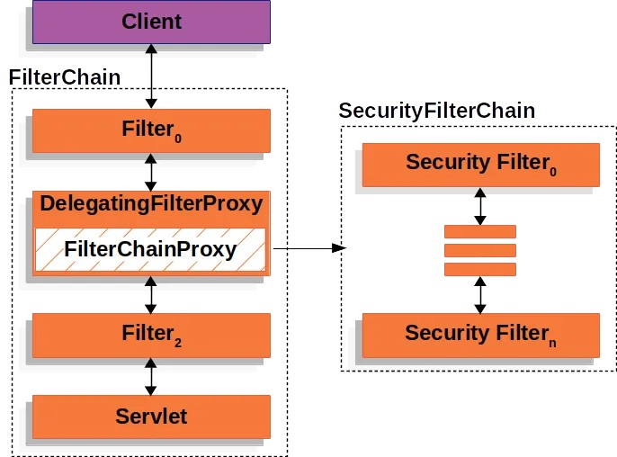
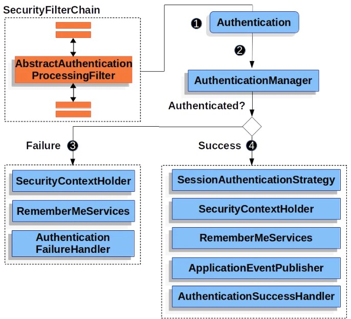
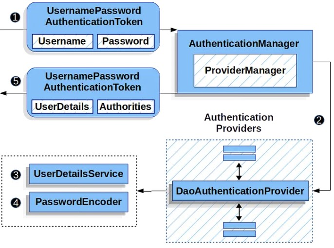
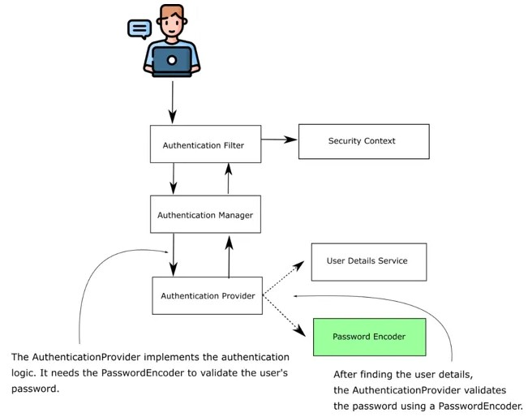

# Spring Security 6: Architecture, Real-World Implementation, and Best Practices

<br>

**ref:**<br>
- https://medium.com/@iiizmkarim/spring-security-6-architecture-real-world-implementation-and-best-practices-75c0a514c65e


<br>
<br>

## Introduction ##
In an era where data breaches cost millions and erode user trust, securing 
applications isn’t optional — it’s existential. Security isn’t just about tools; 
it’s about principles. Principles like **confidentiality** (protecting data from prying 
eyes), **integrity** (ensuring data isn’t tampered with), and availability 
(keeping systems accessible to legitimate users) form the bedrock of robust security. 
Add to these the **principle of least privilege** (granting minimal access required) and 
**defense in depth** (layered protections), and you have a blueprint for building resilient systems.

**Spring Security** isn’t just a framework — it’s a manifestation of these principles. It translates abstract security concepts into actionable code, enforcing safeguards at every layer of your application. But to wield it effectively, you must understand how its architecture aligns with these principles.

This article dissects Spring Security through the lens of **security fundamentals**, providing:

1. A deep dive into its architecture (aligned with principles like defense in depth).
2. Real-world code examples (Spring Security 6.2) that enforce confidentiality, integrity, and least privilege.
3. Best practices to avoid common pitfalls (e.g., misconfigured CORS, weak password hashing).

Let’s bridge theory and practice to build applications that don’t just function — 
they *protect*.


<br>
<br>
<br>

## 1. Security Principles in Action: Mapping Theory to Spring Security

### Principle 1: Defense in Depth

*“Don’t rely on a single safeguard.”*  
Spring Security applies this through:

- **Layered Filters:** A chain of security filters (e.g., authentication, authorization, CSRF*) 
that collectively protect endpoints.
- **Redundant Checks:** Method-level security (`@PreAuthorize`) alongside URL-based rules.


> *CSRF: Cross-Site Request Forgery

### Principle 2: Least Privilege

*“Only grant necessary access.”*

Enforced via:

- **Role-Based Access Control (RBAC):** Restrict endpoints to specific roles.
- **Scope-Based Access in OAuth2:** Limit third-party app permissions.


### Principle 3: Fail-Secure Defaults

*“Deny access unless explicitly permitted.”*  
Spring Security’s default behavior:

- All endpoints require authentication unless whitelisted.
- Automatic CSRF protection for stateful flows.

### Principle 4: Confidentiality & Integrity

*“Protect data from eavesdropping and tampering.”*  
Implemented through:

- HTTPS enforcement (via configuration).
- Password hashing (e.g., `BCryptPasswordEncoder`).
- JWT signature validation.


<br>
<br>
<br>

---

<br>


# 1. Spring Security Architecture: Core Components

Spring Security operates through a chain of filters that intercept incoming 
HTTP requests. These filters work together to enforce security policies.  
Here’s a breakdown of the core components:


## Component 1: `SecurityFilterChain`
### What It Does:

- Defines the order and behavior of security filters applied to incoming requests.
- Each filter in the chain handles a specific security task (e.g., authentication, authorization, CSRF protection).

### Technical Breakdown:

Filters are instances of `javax.servlet.Filter`.
Spring Security provides default filters 
(e.g., `UsernamePasswordAuthenticationFilter`, 
`BearerTokenAuthenticationFilter`), but you can customize the chain.

### Example Configuration:

```java
@Bean  
SecurityFilterChain defaultSecurityFilterChain(HttpSecurity http) throws Exception {  
    http  
        .authorizeHttpRequests(auth -> auth  
            .requestMatchers("/admin/**").hasRole("ADMIN")  
            .anyRequest().authenticated()  
        )  
        .formLogin(Customizer.withDefaults())  
        .addFilterBefore(new CustomFilter(), BasicAuthenticationFilter.class);  
    return http.build();  
}
```

### Filters in Action:
1. A request hits the filter chain.
2. Each filter processes the request in sequence (e.g., check CSRF token, authenticate user).
3. If a filter rejects the request, the chain stops, and an error is returned.



<br>
<br>
<br>

## Component 2: `AuthenticationManager`

### What It Does:

- Coordinates the authentication process by delegating to one or more `AuthenticationProvider` instances.
- Determines if credentials (e.g., username/password, JWT) are valid.

### Technical Flow:

1. Receives an `Authentication` object (e.g., `UsernamePasswordAuthenticationToken`).
2. Delegates validation to the appropriate `AuthenticationProvider`.
3. Returns a fully populated `Authentication` object (with roles, authorities) if successful.

#### Example:

```java
// Custom AuthenticationProvider for API Key validation  
@Component  
public class ApiKeyAuthProvider implements AuthenticationProvider {  
    @Override  
    public Authentication authenticate(Authentication auth) {  
        String apiKey = (String) auth.getCredentials();  
        if (isValidApiKey(apiKey)) {  
            return new ApiKeyAuthenticationToken(apiKey, List.of(new SimpleGrantedAuthority("ROLE_USER")));  
        }  
        throw new BadCredentialsException("Invalid API Key");  
    }  

    @Override  
    public boolean supports(Class<?> authentication) {  
        return ApiKeyAuthenticationToken.class.isAssignableFrom(authentication);  
    }  
}  
```





<br>
<br>
<br>


## Component 3: `UserDetailsService`


### What It Does:

- Loads user-specific data (e.g., username, password, roles) from a storage layer 
(database, LDAP, etc.).
- Returns a `UserDetails` object, which Spring Security uses for authentication and 
authorization.

### Technical Implementation:


```java
@Service  
public class CustomUserDetailsService implements UserDetailsService {  
    @Autowired  
    private UserRepository userRepository;  

    @Override  
    public UserDetails loadUserByUsername(String username) {  
        User user = userRepository.findByEmail(username)  
            .orElseThrow(() -> new UsernameNotFoundException("User not found"));  

        return new org.springframework.security.core.userdetails.User(  
            user.getEmail(),  
            user.getPassword(),  
            user.getRoles().stream()  
                .map(role -> new SimpleGrantedAuthority("ROLE_" + role))  
                .toList()  
        );  
    }  
} 
```



<br>
<br>
<br>

# Component 4: `PasswordEncoder`

## What It Does:

- Encodes (hashes) and validates passwords to ensure they are never stored in plaintext.
- Uses secure algorithms like BCrypt, Argon2, or SCrypt.

## Technical Example:

```java
@Bean  
public PasswordEncoder passwordEncoder() {  
    // BCrypt with strength 12 (recommended for production)  
    return new BCryptPasswordEncoder(12);  
}  

// Usage in UserService  
public void createUser(String username, String rawPassword) {  
    String encodedPassword = passwordEncoder.encode(rawPassword);  
    userRepository.save(new User(username, encodedPassword));  
}  
```

## Why It Matters:

- Prevents password leaks even if the database is compromised.
- Automatically handles salting (unique salt per password).




<br>
<br>
<br>

# Component 5: `SecurityContextHolder`

## What It Does:

- Stores the authenticated user’s details (as an `Authentication` object) for the 
current request thread.
- Uses `ThreadLocal` by default to ensure thread safety.

## Technical Workflow:

- After successful authentication, the `Authentication` object is stored in 
the `SecurityContextHolder`.
- Downstream filters/services access the user’s identity via 
`SecurityContextHolder.getContext().getAuthentication()`.


### Example:

```java
// Accessing the authenticated user in a controller  
@GetMapping("/me")  
public String getCurrentUser() {  
    Authentication auth = SecurityContextHolder.getContext().getAuthentication();  
    return "Logged in as: " + auth.getName();  
}
```

<br>
<br>


# Summary of Component Interactions

1. A request enters the `SecurityFilterChain` and passes through filters.
2. Authentication filters (e.g., `UsernamePasswordAuthenticationFilter`) extract 
credentials and call the `AuthenticationManager`.
3. The `AuthenticationManager` delegates to `AuthenticationProvider`(`s`), which use 
`UserDetailsService` and `PasswordEncoder` to validate credentials.
4. If valid, the authenticated user’s details are stored in `SecurityContextHolder`.
5. Authorization filters check if the user has permission to access the requested resource.


<br>
<br>
<br>
<br>


---


<br>
<br>
<br>
<br>


# 2. Building a Secure Spring Boot Application with Spring Security 6.2

Let’s put theory into practice by building a secure REST API with **JWT authentication, 
role-based access control (RBAC), and method-level security**. 

We’ll also integrate best 
practices like password hashing and HTTPS enforcement.  

<br>

## Step 1 : Project Setup

Add Spring Security to your `pom.xml`  (If you’re using Maven):


```xml
<dependency>
    <groupId>org.springframework.boot</groupId>
    <artifactId>spring-boot-starter-security</artifactId>
</dependency>
```


## Step 2: Configure Spring Security


```java
@Configuration  
@EnableWebSecurity  
@EnableMethodSecurity  
public class SecurityConfig {  
    @Bean  
    public SecurityFilterChain securityFilterChain(HttpSecurity http) throws Exception {  
        http  
            .csrf(csrf -> csrf.disable()) // Disable CSRF for stateless APIs  
            .authorizeHttpRequests(auth -> auth  
                .requestMatchers("/api/auth/**").permitAll() // Public auth endpoints  
                .requestMatchers("/api/admin/**").hasRole("ADMIN")  
                .anyRequest().authenticated()  
            )  
            .sessionManagement(session -> session  
                .sessionCreationPolicy(SessionCreationPolicy.STATELESS) // No sessions  
            )  
            .addFilterBefore(jwtAuthFilter(), UsernamePasswordAuthenticationFilter.class);  

        return http.build();  
    }  

    @Bean  
    public PasswordEncoder passwordEncoder() {  
        return new BCryptPasswordEncoder(12); // Secure password hashing  
    }  

    @Bean  
    public JwtAuthFilter jwtAuthFilter() {  
        return new JwtAuthFilter();  
    }  
}  
```

### Key Features:

- **Stateless JWT Authentication:** No session cookies.
- **Role-Based Access:** `/api/admin/**` requires `ADMIN` role.
- **Custom JWT Filter:** Processes JWT tokens in requests.


## Step 3: Implement User Management

#### User Entity:

```java
@Entity  
public class User {  
    @Id  
    @GeneratedValue(strategy = GenerationType.IDENTITY)  
    private Long id;  
    private String email;  
    private String password;  
    private String role; // e.g., "USER", "ADMIN"  
}  
```


#### User Registration Endpoint:

```java
@RestController  
@RequestMapping("/api/auth")  
public class AuthController {  

    @Autowired  
    private UserRepository userRepository;  
    @Autowired  
    private PasswordEncoder passwordEncoder;  

    @PostMapping("/register")  
    public ResponseEntity<String> register(@RequestBody User user) {  
        user.setPassword(passwordEncoder.encode(user.getPassword()));  
        userRepository.save(user);  
        return ResponseEntity.ok("User registered");  
    }  
}  
```

## Step 4: JWT Authentication

```java
@Service  
public class JwtService {  
    private static final String SECRET_KEY = "your-secret-key-1234567890"; // Use environment variables!  

    public String generateToken(String username, String role) {  
        return Jwts.builder()  
            .subject(username)  
            .claim("role", role)  
            .issuedAt(new Date(System.currentTimeMillis()))  
            .expiration(new Date(System.currentTimeMillis() + 1000 * 60 * 30)) // 30 minutes  
            .signWith(SignatureAlgorithm.HS256, SECRET_KEY)  
            .compact();  
    }  

    public Claims validateToken(String token) {  
        return Jwts.parser()  
            .verifyWith(SECRET_KEY)  
            .build()  
            .parseSignedClaims(token)  
            .getPayload();  
    }  
}  
```

#### JWT Filter:

```java
public class JwtAuthFilter extends OncePerRequestFilter {  

    @Autowired  
    private JwtService jwtService;  

    @Override  
    protected void doFilterInternal(  
        HttpServletRequest request,  
        HttpServletResponse response,  
        FilterChain filterChain  
    ) throws ServletException, IOException {  

        String authHeader = request.getHeader("Authorization");  
        if (authHeader == null || !authHeader.startsWith("Bearer ")) {  
            filterChain.doFilter(request, response);  
            return;  
        }  

        String token = authHeader.substring(7);  
        Claims claims = jwtService.validateToken(token);  

        Authentication auth = new UsernamePasswordAuthenticationToken(  
            claims.getSubject(),  
            null,  
            List.of(new SimpleGrantedAuthority(claims.get("role", String.class))  
        );  

        SecurityContextHolder.getContext().setAuthentication(auth);  
        filterChain.doFilter(request, response);  
    }  
}  
```


## Step 5: Secure Endpoints with Method-Level Security


#### Admin Controller:

```java
@RestController  
@RequestMapping("/api/admin")  
public class AdminController {  

    @PreAuthorize("hasRole('ADMIN')")  
    @GetMapping("/dashboard")  
    public ResponseEntity<String> adminDashboard() {  
        return ResponseEntity.ok("Admin Dashboard");  
    }  
}  
```

#### User Controller:

```java
@RestController  
@RequestMapping("/api/user")  
public class UserController {  

    @GetMapping("/profile")  
    @PreAuthorize("hasRole('USER') or hasRole('ADMIN')")  
    public ResponseEntity<String> userProfile() {  
        return ResponseEntity.ok("User Profile");  
    }  
}  
```

## Step 6: Test Security Configuration

### Integration Test:

```java
@SpringBootTest  
@AutoConfigureMockMvc  
public class SecurityTest {  

    @Autowired  
    private MockMvc mockMvc;  

    @Test  
    @WithMockUser(roles = "ADMIN")  
    void testAdminEndpoint() throws Exception {  
        mockMvc.perform(get("/api/admin/dashboard"))  
            .andExpect(status().isOk());  
    }  

    @Test  
    @WithMockUser(roles = "USER")  
    void testUserEndpointAccessDenied() throws Exception {  
        mockMvc.perform(get("/api/admin/dashboard"))  
            .andExpect(status().isForbidden());  
    }  
}  
```

<br>

## Best Practices Recap

1. **Store Secrets Securely:** Use environment variables or tools like Vault for `SECRET_KEY`.
2. **Enable HTTPS:** Add SSL configuration in `application.properties`.
3. **Rate Limiting:** Protect `/api/auth/login` from brute-force attacks.
4. **CORS Configuration:** Restrict cross-origin requests.
5. **Logging & Monitoring:** Track authentication attempts and failures.


## Result :

You’ve built a Spring Security 6.2 application that enforces:

- **Confidentiality** via HTTPS and JWT.
- **Integrity** through password hashing and token signatures.
- **Least Privilege** with RBAC and method-level security.
- **Defense in Depth** using layered filters and stateless sessions.

### Next Steps:

- Add OAuth2 login (e.g., Google, GitHub).
- Implement refresh tokens for long-lived sessions.
- Explore Spring Security’s reactive stack for WebFlux.

<br>

---

<br>

To deepen your understanding of Spring Security and stay updated with best practices, 
here are essential resources and documentation links:

<br>

### Official Spring Security Documentation

1. Spring Security Reference (6.2):  
https://docs.spring.io/spring-security/reference/index.html  
*The official guide covering architecture, configuration, and features like OAuth2, SAML, and method-level security.*

2. Spring Security GitHub Repository:  
https://github.com/spring-projects/spring-security  
*Explore the source code, report issues, or contribute to the project.*

3. JWT Support in Spring Security:  
https://docs.spring.io/spring-security/reference/servlet/oauth2/resource-server/jwt.html  
*Detailed guide on configuring JWT authentication for REST APIs.*

4. OAuth2 Login with Spring Security:  
https://docs.spring.io/spring-security/reference/servlet/oauth2/login/core.html  
*Step-by-step instructions for integrating Google, GitHub, or other OAuth2 providers.*

5. Spring Security Testing:  
https://docs.spring.io/spring-security/reference/servlet/test/index.html  
*Learn how to write integration tests with mocked users and roles.*


<br>

### Related Spring Guides

1. Securing a Web Application:  
https://spring.io/guides/gs/securing-web/  
A hands-on tutorial for basic Spring Security setup.
2. Building a RESTful Web Service with Spring Boot:  
https://spring.io/guides/gs/rest-service/  
Pair this with Spring Security to secure your REST endpoints.
3. Spring Boot and OAuth2:  
https://spring.io/guides/tutorials/spring-boot-oauth2/  
Implement social login and token-based authentication.

<br>

### Community Resources

1. Baeldung Spring Security Tutorials:  
https://www.baeldung.com/security-spring  
Practical articles on topics like JWT, CSRF, and method-level security.  
2. Spring Security on Stack Overflow:  
https://stackoverflow.com/questions/tagged/spring-security  
Troubleshoot common issues with help from the developer community.  
3. JWT Library Documentation:  
https://github.com/jwtk/jjwt  
Learn how to create and validate JWTs programmatically.  

<br>